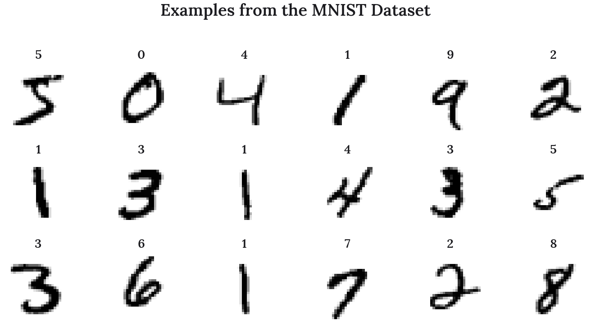
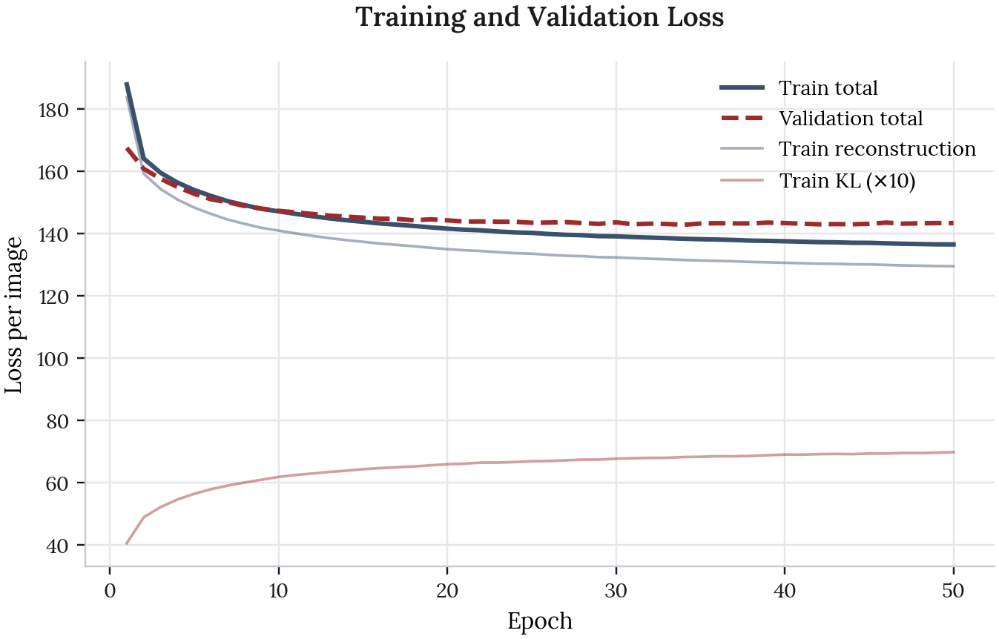
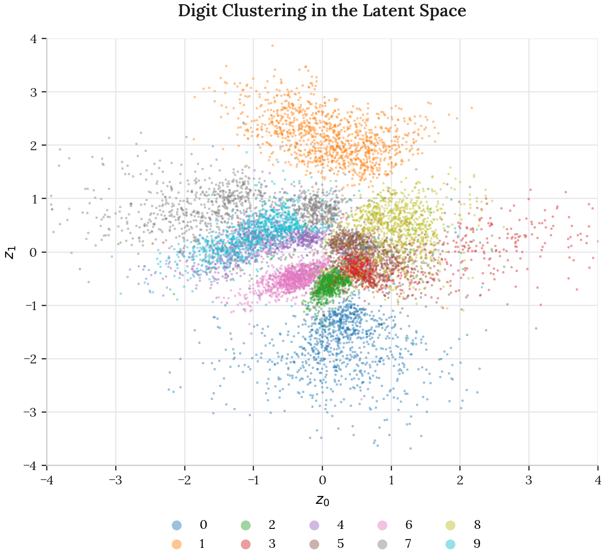
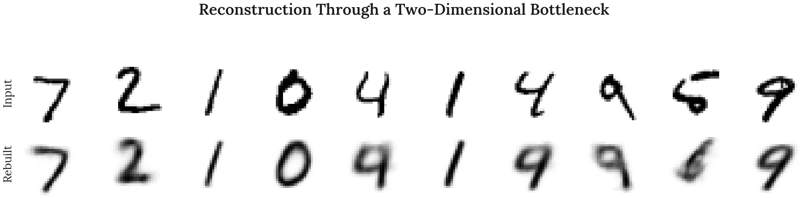
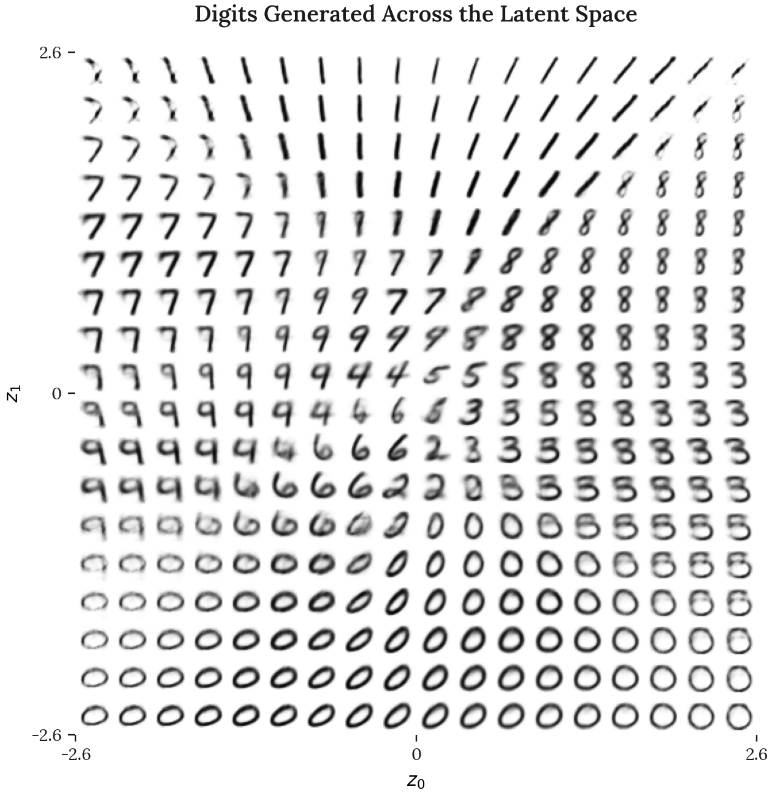

This project builds a variational autoencoder (VAE) that compresses 28 x 28 handwritten digit images into a two-dimensional latent space and then reconstructs them from those two values alone. Unlike a standard autoencoder, which learns a fixed encoding, a VAE learns a probability distribution over the latent space. This makes the space continuous, which means new digits can be generated by sampling from regions the model has never seen directly. The latent dimension is set to 2 so that the learned structure can be plotted and inspected rather than inferred.

This is an early project, and the two-dimensional bottleneck is a deliberate teaching constraint rather than a performance choice. What it buys is that every claim below can be checked by looking at a picture.

**Source code**: [github.com/olivia-jackson-lambert/digit-variational-autoencoder](https://github.com/olivia-jackson-lambert/digit-variational-autoencoder)

# Data Exploration

The MNIST dataset contains 60,000 training images and 10,000 test images of handwritten digits, each 28 x 28 pixels in greyscale. Images are reshaped to include a single channel dimension, scaled to the range 0 to 1, and shuffled before training.

{fig-alt="Eighteen example handwritten digits from the MNIST dataset" fig-align="center" width="72%"}

# Building the Variational Autoencoder

The encoder maps each image into a distribution in the latent space, defined by a mean and a log-variance. The decoder maps a point sampled from that distribution back to an image.

## Encoder

#### 0 - Input Layer
- Creates a layer of the correct dimensions for the 28 x 28 images.

#### 1 - Convolutional Layers
- 32, 64 and 128 filter sizes chosen to provide sufficient representational power for MNIST while keeping the model lightweight and efficient.
- 3 x 3 kernel size chosen to capture local stroke features such as curves and junctions without over-smoothing.
- Strides of 1, 2 and 2 chosen to progressively reduce spatial dimensions while increasing filter depth.

#### 2 - Flatten and Dense Layer
- Feature maps are flattened into a 1D array to simplify the transition into the latent space.
- A 256-unit dense layer is added for further feature extraction before the bottleneck.

#### 3 - Latent Distribution
- Two parallel dense layers output `z_mean` and `z_log_var`, the parameters of a Gaussian rather than a single fixed encoding.

## Sampling

The sampling layer draws a point from the distribution the encoder produced, using the reparameterisation trick:

$$z = \mu + \exp(0.5 \log \sigma^2) \odot \epsilon, \qquad \epsilon \sim \mathcal{N}(0, 1)$$

The randomness is isolated in $\epsilon$, which is treated as an input rather than a parameter. This keeps the operation differentiable so that gradients can still flow back through the encoder during training.

## Decoder

#### 0 - Input Layer
- Input layer has the latent space dimension of 2, as this is the output shape from the encoder.

#### 1 - Dense Layers
- Two hidden dense layers are added with 256 units each, matching the encoder.
- Dense layers chosen to capture global relationships between all parts of the latent vector and the reconstructed image.
- ReLU activation to expand the latent representation back towards the original dimensionality.

#### 2 - Output Layer
- A final dense layer with 784 units and sigmoid activation produces pixel values in the range 0 to 1.
- The output is reshaped back to 28 x 28 x 1 to match the original image shape.

## Loss Function

Training optimises two terms which pull against each other:

1. **Reconstruction loss** uses binary cross-entropy summed over pixels, and measures how well the VAE reproduces the input image.
2. **Kullback-Leibler (KL) loss** measures how far the learned latent distribution has drifted from a unit Gaussian, and is what keeps the latent representation continuous.

Reconstruction loss alone would allow the model to scatter encodings anywhere it liked, leaving gaps between them. The KL term is what makes the space samplable.

# Training

The model was trained for 50 epochs with a batch size of 128 using the Adam optimizer, validating against the test set.

| Loss component | Epoch 1 | Epoch 50 |
|---|--:|--:|
| Total | 188.0 | **136.6** |
| Reconstruction | 183.9 | 129.6 |
| KL | 4.1 | 7.0 |
| Validation total | 167.6 | 143.4 |

{fig-alt="Training and validation loss curves across 50 epochs" fig-align="center" width="82%"}

Two things are visible in the curves. The KL term rises steadily, from 4.1 to 7.0, while reconstruction falls from 183.9 to 129.6. The model is buying reconstruction quality by letting the latent distribution drift further from the prior, which is exactly the trade the two terms are designed to negotiate.

Training and validation also separate after about epoch 15, finishing at 136.6 against 143.4. The gap is small but real, and it means the later epochs are improving the fit to the training set slightly faster than they improve the model. Training could reasonably have stopped earlier.

# The Latent Space

## Digit Clustering

{fig-alt="Test digits plotted in the two-dimensional latent space, coloured by class" fig-align="center" width="78%"}

Each digit class occupies its own region of the latent space, despite the model never having seen the labels. The clustering is learned entirely from pixel structure.

As this is a variational autoencoder it is a given that some digits will overlap. Fitting a Gaussian to each class and measuring the Bhattacharyya coefficient between every pair puts numbers on which ones:

| Digit pair | Overlap | | Digit pair | Overlap |
|---|--:|---|---|--:|
| **4 and 9** | **0.950** | | 7 and 9 | 0.671 |
| 3 and 5 | 0.794 | | 2 and 3 | 0.600 |
| 5 and 8 | 0.740 | | 0 and 1 | 0.002 |
| 3 and 8 | 0.684 | | 1 and 6 | 0.002 |

A coefficient of 1.0 would mean two classes are indistinguishable. At 0.950, fours and nines are very nearly on top of one another, which makes sense: both are a closed or near-closed loop above a vertical stroke, and the only reliable difference is whether the loop closes. Zeros and ones, which share no stroke structure at all, sit at 0.002.

A nearest-centroid rule in this two-dimensional space recovers the correct digit 69.8 percent of the time. That is far above the 10 percent chance rate for a model given no labels, and far below what any supervised classifier would manage, which is a fair summary of what two dimensions can hold.

## Reconstruction

{fig-alt="Ten test digits above their reconstructions through the two-dimensional bottleneck" fig-align="center" width="100%"}

Reconstructions are recognisable but soft, and the failures are the informative part. Two fours come back as nines and a five comes back as a six. These are not random errors: they are the same pairs the overlap table identifies, showing up in individual images.

## Generating Digits

Sampling points on a regular grid across the latent space and decoding each one shows what the model has actually learned.

{fig-alt="An 18 by 18 grid of digits generated by decoding points spanning the latent space" fig-align="center" width="82%"}

In areas where there is overlap, digits can be seen in an intermediate morphing stage. Areas where the probability of a certain digit is high have sharp, clearly defined digits, such as the 8s at the top right and the 0s along the bottom.

This grid is the clearest evidence that the space is continuous rather than merely clustered. A standard autoencoder would leave unusable gaps between the clusters, whereas here every point decodes to something digit-like.

# A Note on Reproducing This

The original notebook was written in Keras against `tensorflow.python.keras`, which no longer exists in current TensorFlow, so it cannot be run today. The figures here come from a PyTorch re-implementation with the architecture, loss function and hyperparameters unchanged.

The re-implementation lands close to the original: a final training loss of 136.6 against the original's 138.6, and KL rising from 4.1 to 7.0 against 4.8 to 6.8. The one difference is the train-validation gap, which the original run did not show. The qualitative findings, and specifically which digits overlap, reproduce.

# Limitations

**Two latent dimensions is a presentation choice.** It is what makes the space directly plottable, but it caps reconstruction quality well below what a larger bottleneck would reach. The softness in the generated grid is a consequence of that constraint rather than of the training.

**Sample quality is assessed by eye.** Loss values and visual inspection are the only measures used. No quantitative sample-quality metric is applied.

**No baseline comparison.** A standard autoencoder trained on the same architecture would isolate how much of the latent-space smoothness the KL term is actually responsible for, rather than assuming it.

# Next Steps

**Latent dimensionality**: Train at higher latent dimensions and compare reconstruction loss, using a dimensionality reduction method such as t-SNE to inspect the structure that can no longer be plotted directly.

**Conditional generation**: Extend to a conditional VAE so that a specific digit class can be requested, rather than sampling wherever that class happens to sit.

**Loss weighting**: Vary the weighting on the KL term to trace the trade-off between reconstruction sharpness and latent continuity.
