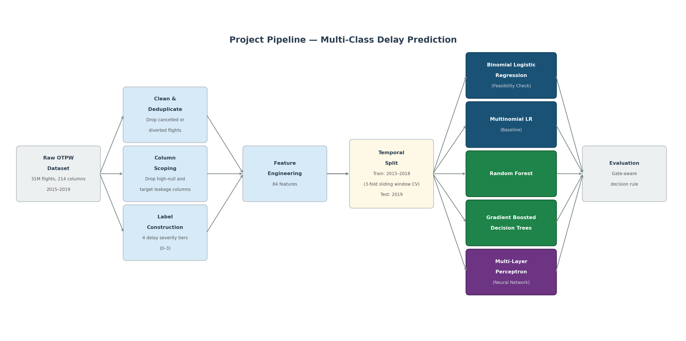
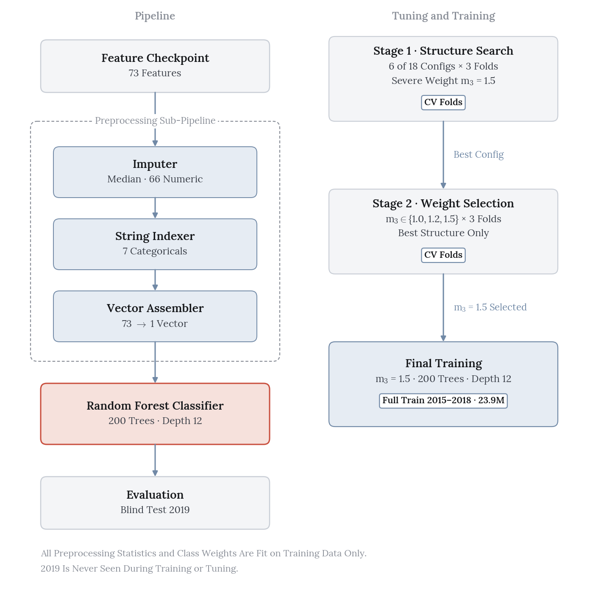
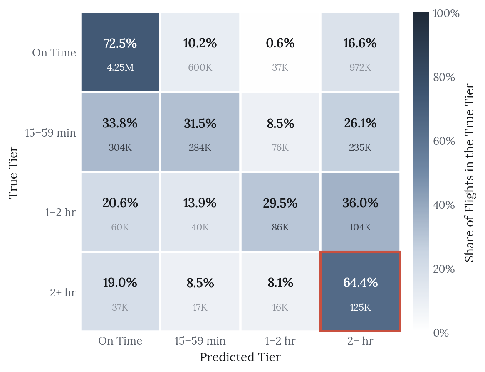
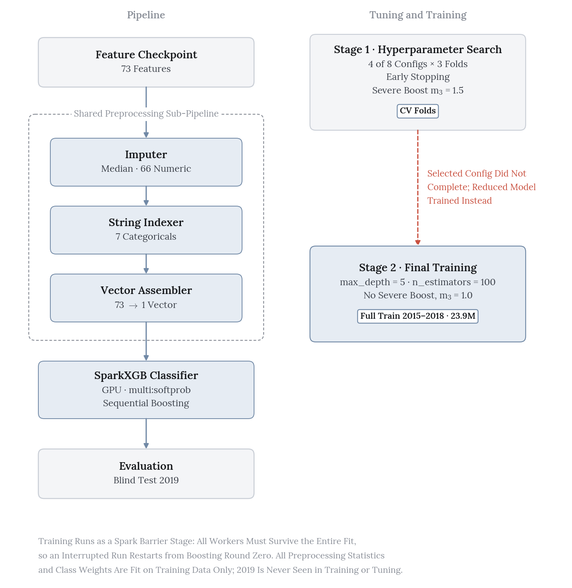
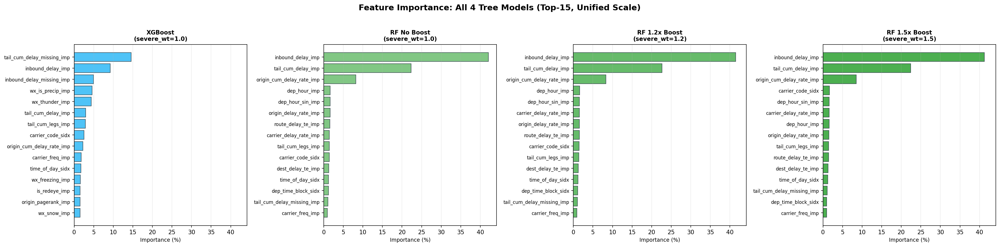
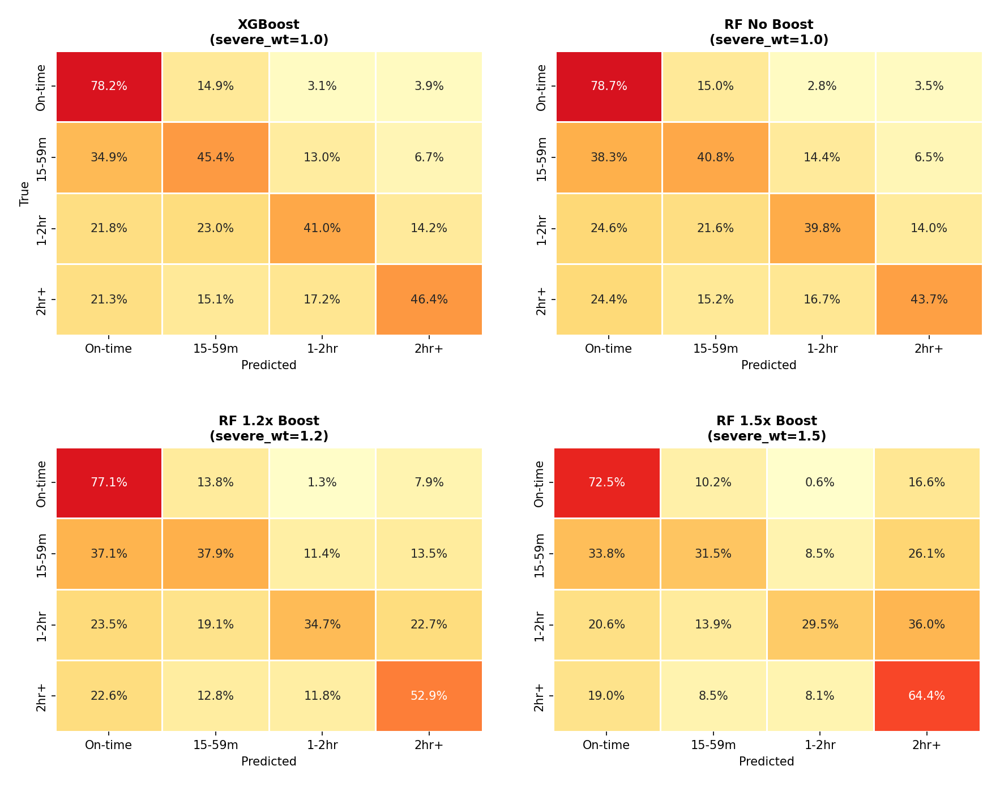

::: {.cs-top}
[In collaboration with Parul Lakhotia, Ewura Impraim Mensah, Roshni Misra and Sarah Son]{.cs-with}

::: {.cs-keys}
::: {.cs-key}
[The Decision]{.cs-label}

[Select the only model that clears the 50% severe-delay recall floor, even at the cost of overall agreement.]{.cs-decision}
:::

::: {.cs-key}
[Takeaways]{.cs-label}

- The severe-weighted random forest recovered 64.4% of 2+ hour delays on the 2019 blind test.
- Writing the decision rule down in advance is what made that trade defensible.
- Four model families stall at the same boundary, which points to the features as the limit.
:::
:::
:::

Flight delays cost the US economy roughly \$33&nbsp;billion a year, and passengers bear
more than half of it. This project predicts *how late* a domestic flight will arrive. Each
flight goes into one of four ordered tiers, using only information available about two
hours before scheduled departure.

The model we selected has the *worst* overall agreement of our four finalists. We chose it
anyway, on purpose, and that choice is the most interesting part of the project.

```{=html}
<div class="kpi-grid">
  <div class="kpi">
    <div class="label">Scale</div>
    <div class="value">31.1M flights, 2015&ndash;2019</div>
  </div>
  <div class="kpi">
    <div class="label">Tree Models</div>
    <div class="value">Random forest &amp; XGBoost</div>
  </div>
  <div class="kpi">
    <div class="label">Outcome</div>
    <div class="value">64.4% severe recall on blind test</div>
  </div>
</div>
```


## The Framing Problem

About 82% of flights arrive on time and only 2.2% are severely delayed. A model that
predicts "on time" for every flight scores 82% accuracy and is useless to an FAA operator.
We rejected accuracy as a success measure before any modeling started.

Instead we pre-registered a decision rule. It shaped the final outcome more than any
hyperparameter did.

- **Gate 1.** Macro F1 above the 0.224 four-class majority floor.
- **Gate 2.** Recall of at least 0.50 on the 2+ hour tier.
- Models that pass both gates rank on quadratic-weighted Cohen's kappa ($\kappa_w$), which
  penalizes a three-tier miss far more than a one-tier miss.
- An asymmetric expected cost per flight (ECPF) breaks ties. It charges double for
  under-prediction, because missing a severe delay costs more than over-preparing for one.

Writing the rule down in advance is what let us defend the final selection later.

{fig-alt="Flow diagram. The raw OTPW dataset (31M flights, 214 columns, 2015 to 2019) branches into cleaning, column scoping and label construction, which merge into feature engineering. A temporal split (train 2015 to 2018 with three-fold sliding-window CV, test 2019) feeds binomial logistic regression, multinomial logistic regression, random forest, gradient-boosted trees and a multilayer perceptron, all of which feed a gate-aware evaluation." width="80%"}

All of 2019 was held out as a blind test set (7.24M flights). The years 2015 to 2018
supported three-fold sliding-window cross-validation, with a one-year training window and a
three-month validation window per fold.

## Random Forest: Buying Severe Recall

The Phase 2 forest failed Gate 2 badly, at 0.351 severe recall against the 0.50 floor. For
Phase 3 the data grew from one year to five (5.7M to 23.9M training flights) and the
feature set from 41 to 73 columns. That was not enough on its own, so we added a
severe-class weight multiplier on top of standard inverse-frequency weighting.

{fig-alt="Two-column block diagram. On the left, a 73-feature checkpoint passes down through a median imputer for 66 numeric columns, a string indexer for 7 categoricals and a vector assembler, then into the highlighted random forest classifier with 200 trees at depth 12, evaluated on the 2019 blind test. On the right, stage 1 is a structure search in which 6 of 18 configurations completed across 3 folds at a severe weight of 1.5. The best configuration moves to stage 2, which cross-validates severe weights of 1.0, 1.2 and 1.5. The selected weight of 1.5 goes to final training on the full 2015 to 2018 set of 23.9M flights." fig-align="center" width="85%"}

### Staged Search

We ran selection in two stages instead of one large grid. The weight and the tree structure
interact, and a single grid would have been slower and harder to read.

**Stage 1** fixed the multiplier at 1.5 and varied tree structure. Six of eighteen planned
configurations completed before an executor crash halted the deeper trees, so `maxDepth`
15 and 18 remain untested.

| # | Feature subset | minInst | Val $\kappa_w$ | Val macro F1 | Val severe recall |
|:--:|:--|:--:|--:|--:|--:|
| 1 ★ | sqrt | 10 | **0.257** | 0.416 | 0.585 |
| 2 | sqrt | 20 | 0.257 | 0.416 | **0.588** |
| 3 | onethird | 10 | 0.250 | **0.429** | 0.569 |
| 4 | onethird | 20 | 0.250 | 0.429 | 0.571 |
| 5 | 0.5 | 10 | 0.251 | 0.428 | 0.565 |
| 6 | 0.5 | 20 | 0.250 | 0.427 | 0.568 |

`sqrt` feature subsetting won on both $\kappa_w$ and severe recall, and it trained fastest.
Our reading is that limiting the features each split can see pushes the trees onto the few
high-signal propagation features that separate severe delays. With more features per split,
the splits spread across weak weather and calendar columns. Leaf size barely mattered.
Moving `minInstancesPerNode` between 10 and 20 changed every metric by 0.003 or less, so
the regularization came from bagging and feature subsampling rather than leaf constraints.

{fig-alt="Scatter plot of validation severe recall against validation quadratic-weighted kappa for the six completed random forest configurations. The two sqrt points sit at the top right, near kappa 0.257 and recall 0.585 to 0.588, with the selected sqrt, minInstances 10 configuration labeled. Separate legends give the feature subset (by colour) and minInstancesPerNode of 10 or 20 (by marker shape). The onethird and 0.5 points cluster at the left, near kappa 0.250 and recall 0.565 to 0.571. A dashed line marks the Gate 2 floor at 0.50 recall, below every point." fig-align="center" width="85%"}

**Stage 2** re-ran cross-validation on the winning structure across severe-class
multipliers. The result is cleanly monotonic, and it tells the story of the whole project.

| $m_3$ | Val $\kappa_w$ | Val macro F1 | Val severe recall | Gate 2 |
|:--:|--:|--:|--:|:--:|
| 1.0 | **0.398** | **0.451** | 0.410 | ✗ |
| 1.2 | 0.341 | 0.434 | 0.485 | ✗ |
| **1.5** ★ | 0.257 | 0.416 | **0.585** | **✓** |

### Why Cross-Validating the Weight Mattered

On blind-test numbers alone, $m_3$=1.2 *looks* like it passes Gate 2. Its test severe
recall is 0.529, with much better ordinal agreement than 1.5 ($\kappa_w$ 0.336 against
0.241). It would have been the obvious pick.

Cross-validation disagrees. At $m_3$=1.2 the validation severe recall is 0.485, below the
floor. Validation runs harder than the blind test at all three multipliers, by 0.03 to 0.06
on severe recall. Each fold validates on a first-quarter window, where delays are heavier
and more weather-driven than across a full year.

Choosing 1.2 on test evidence would have shipped a configuration that does not reliably
meet the operational floor on held-out data. A blind test exists to prevent exactly that.

## The Frontier

The selected forest (200 trees, depth 12, `sqrt` subsetting, 1.5× severe weight) was the
only model in the project to clear Gate 2 on the blind test, at **64.4% severe recall**. It
also has the worst $\kappa_w$ and the highest expected cost of any finalist.

| Blind test (2019) | $\kappa_w$ | Macro F1 | Severe recall | ECPF | Gate 2 |
|---|--:|--:|--:|--:|:--:|
| Multinomial LR (hybrid down/up) | 0.438 | 0.394 | 0.418 | 0.848 | Fail |
| MLP (oversample to 25%) | **0.490** | **0.493** | 0.399 | **0.715** | Fail |
| XGBoost (no severe weight) | 0.406 | 0.455 | 0.464 | 0.877 | Fail |
| **Random forest (1.5× severe weight)** ★ | 0.241 | 0.402 | **0.644** | 1.743 | **Pass** |

The severe weight has a price under our own cost function. The forest recovers nearly
two-thirds of the 2+ hour tier by predicting severe delays for a large number of on-time
flights, and the asymmetric cost matrix charges for each one. The multiplier works as an
operating-point control. It does not make the model better at prediction overall.

The same trade-off shows up across model families, which is why we read it as a frontier
and not a tuning failure. The MLP's full-rebalance setting reaches 0.489 severe recall, but
its $\kappa_w$ drops to 0.339. The forest traces the same curve across its three
multipliers. Four model families plateau at the same boundary.

{fig-alt="Four by four confusion matrix with true tiers as rows and predicted tiers as columns: on time, 15 to 59 minutes, 1 to 2 hours, 2+ hours. The diagonal reads 72.5%, 31.5%, 29.5% and 64.4%. The outlined 2+ hour cell holds 125K flights. The top-right cell shows 16.6% of on-time flights, about 972K, predicted as severe. The two middle tiers spread mostly into the on-time and 2+ hour columns." fig-align="center" width="80%"}

## Gradient-Boosted Trees, and What Went Wrong

We expected XGBoost to beat the forest. It never got a fair trial.

The severe-weighted XGBoost configuration cleared Gate 2 on validation, at 0.534 severe
recall. It could never be trained to completion on the full training window. Runs died on
driver out-of-memory failures, and the grid stopped after four of eight planned
configurations. The XGBoost row above therefore comes from a reduced substitute with no
severe weight. It is not the model we would want judged.

{fig-alt="Two-column block diagram matching the random forest pipeline, with a SparkXGB classifier on GPU in place of the forest. On the right, stage 1 shows 4 of 8 configurations completed across 3 folds with early stopping and a severe weight of 1.5. A dashed rust arrow notes that the selected configuration did not complete, so stage 2 trained a reduced model (max_depth 5, 100 estimators, no severe weight) on the full 2015 to 2018 data instead." fig-align="center" width="85%"}

XGBoost remains the most promising unexplored direction. The validation evidence suggests
a severe-weighted configuration could hold Gate 2 at higher $\kappa_w$ than the forest,
which would beat our selected model outright. It needs more resilient compute than we had.

That fragility shaped how we ran every search. Executors died mid-grid, so we checkpointed
each completed configuration and wrapped fits in retry logic. A crash then cost one
configuration instead of the whole run. That is why the random forest grid produced six
usable points instead of none.

## The Ceiling Is in the Features

Feature importance is dominated by delay propagation. `inbound_delay` alone accounts for
41.3% of total Gini importance, `tail_cum_delay` for 22.4% and `origin_cum_delay_rate` for
8.5%, about 72% of the model together. Weather contributes roughly 3%, mostly through
precipitation.

{fig-alt="Four horizontal bar charts of feature importance in percent in a two by two grid, one per tree model. In all three random forests, inbound_delay_imp leads at about 41%, followed by tail_cum_delay_imp at about 22% and origin_cum_delay_rate_imp at about 8%, with every other feature under 2%. XGBoost spreads importance differently, led by tail_cum_delay_missing_imp at about 15% and inbound_delay_imp at about 9%." width="100%"}

Per-class test recalls for the selected forest are 0.725, 0.315, 0.295 and 0.644 across the
four tiers. The middle tiers are the weak spot in every configuration. None of the four
tree models gets them above 46% recall, and they fall to about 30% as the severe weight
rises. The confusion matrix shows those flights spreading into the on-time and severe tiers
more than into each other. Extra severe weight only pulls more of them into the severe
tier.

{fig-alt="Four confusion matrices in a two by two grid for XGBoost, random forest with no severe weight, random forest at 1.2 times and random forest at 1.5 times. Severe-tier recall rises from 46.4% and 43.7% to 52.9% and 64.4%. On-time recall falls from about 78% to 72.5%, and middle-tier recall falls from roughly 40% to 45% down to about 30%." width="100%"}

The most plausible explanation is that a 20-minute delay and a 90-minute delay look almost
identical two hours before departure. If so, the binding constraint is the feature set, in
particular the thin weather and network signal available at that horizon. Model capacity is
not the limit. That is useful to know, because it points the next round of work away from
bigger models.

## Limitations

**The search is incomplete.** Six of eighteen random forest grid points and four of eight
XGBoost configurations finished. All six surviving forest points sit at `maxDepth` 12, so
the selected model may be a local optimum.

**The model underfits.** Train-to-test $\kappa_w$ gaps are 0.005, 0.001 and 0.001 across
the three multipliers. For the selected model, train and test agree to three decimal places
(0.242 and 0.241). That is further evidence that the constraint is signal, not variance.

**Phase 3 is not better than Phase 2 on every measure.** Severe recall nearly doubled
(0.351 to 0.644) while $\kappa_w$ fell from 0.426 to 0.241. The model is better on the
criterion the stakeholder called non-negotiable and worse on overall agreement.

## Next Steps

The immediate lever is a cost-sensitive ensemble. A cost-weighted blend of the forest's
severe sensitivity and the MLP's tier ranking could recover $\kappa_w$ without giving up
the Gate 2 pass. Finishing the forest depth grid and training the severe-weighted XGBoost
configuration on more resilient compute would settle whether a boosted model can hold the
gate at higher agreement. Longer term, the feature ceiling calls for richer weather signal,
such as destination-airport conditions and multi-hour trajectories in place of a single
snapshot, more than for extra model capacity.

## References

Ball, M. et al. "Total Delay Impact Study: A Comprehensive Assessment of the Costs and
Impacts of Flight Delay in the United States." NEXTOR / FAA (2010).

Data: On-Time Performance with Weather (OTPW), joining U.S. DOT/BTS on-time performance
records to NOAA hourly weather observations.
