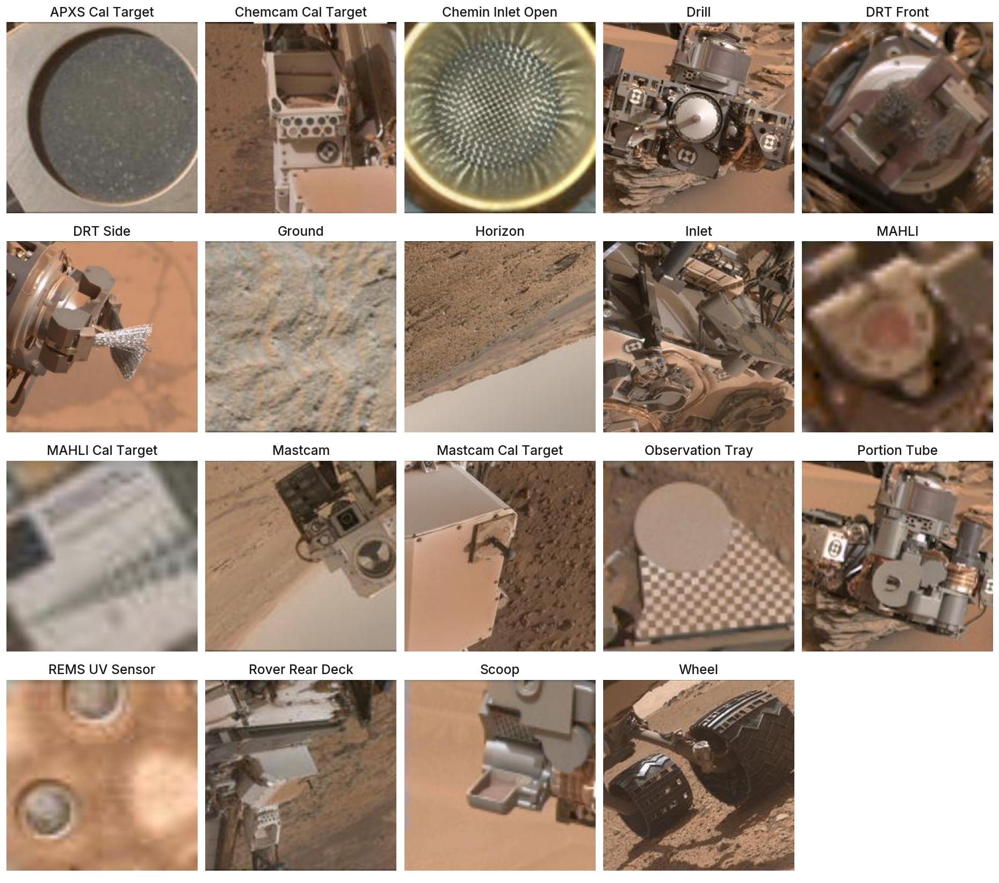
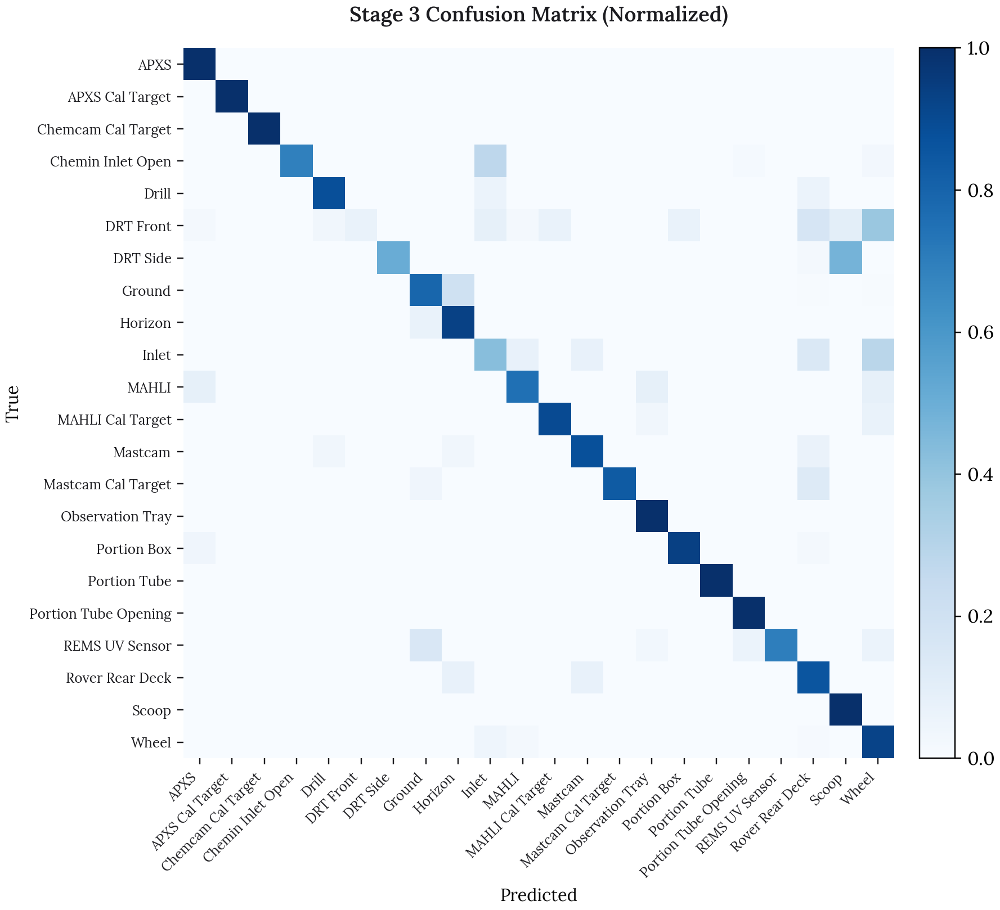
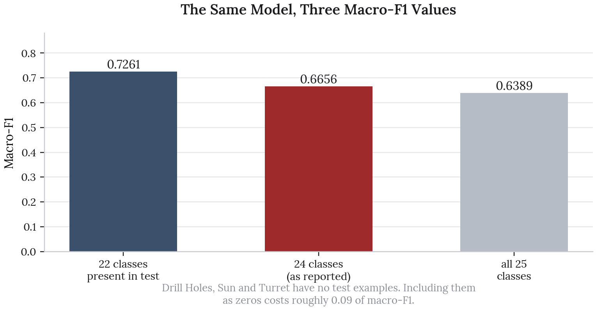
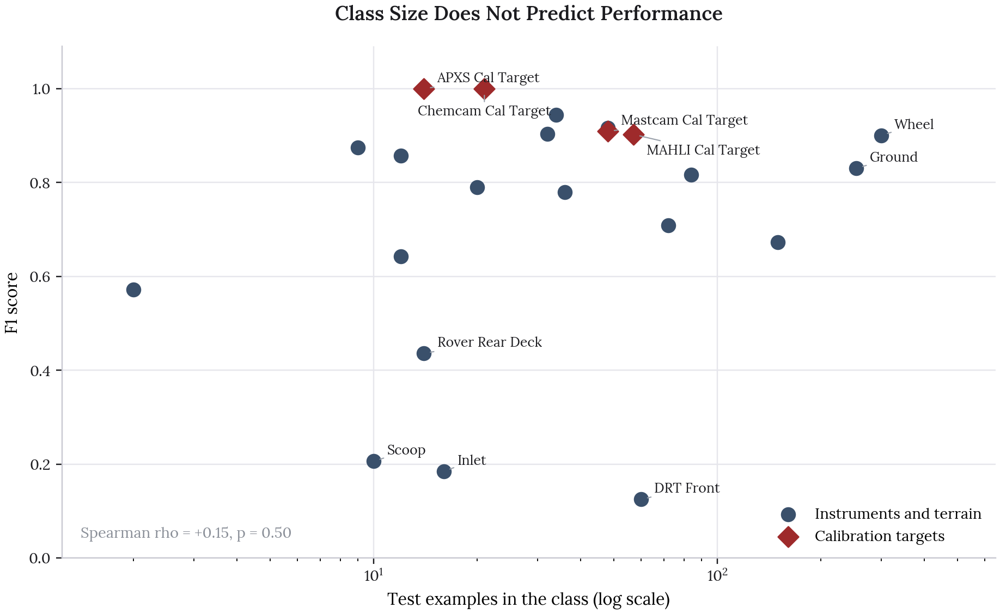
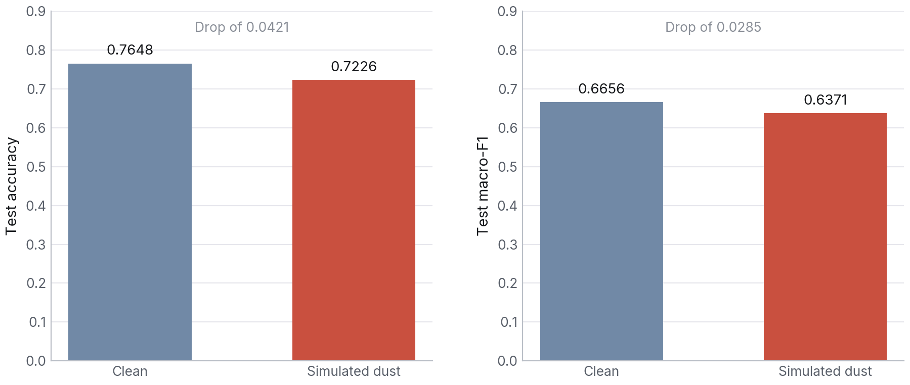

::: {.cs-top}
[In collaboration with Emily Mader, Sarah Son, Peter Le and Will Yang]{.cs-with}

::: {.cs-keys}
::: {.cs-key}
[The Decision]{.cs-label}

[Judge the classifier on macro-F1 across rare classes rather than on headline accuracy.]{.cs-decision}
:::

::: {.cs-key}
[Takeaways]{.cs-label}

- Class weighting took the final model to 76.5% accuracy and 0.666 macro-F1 on held-out images.
- Performance tracks how distinctive a class looks, not how many examples it has.
- Under simulated dust on the optics, accuracy falls by only 4.2 points.
:::
:::
:::

Autonomous navigation on Mars depends on the rover recognising what it is looking at. This project trains a three-stage transfer learning pipeline on ResNet-50 to classify images from Curiosity's onboard cameras across 25 label classes, covering surface features such as ground and horizon, rover instruments such as the drill and scoop, and the calibration targets each instrument carries.

The project's own headline is that overall accuracy is a misleading metric for planetary data, and that holds up. Working back through the held-out predictions surfaced two further things the report does not claim, and both are in the write-up below.

**Source code**: [github.com/olivia-jackson-lambert/mars-project](https://github.com/olivia-jackson-lambert/mars-project)

# The Data

The dataset was collected by Stanboli and Wagstaff at NASA in 2017 from three of Curiosity's onboard cameras. It contains 6,691 labelled images. Aspect ratios are not standardised, running as wide as 3.0, so images are padded by reflection to a square 256 by 256 rather than stretched, which would distort the instrument geometry the model needs to read.

{fig-alt="A grid of real Curiosity camera images, one per class, labelled with the class name" fig-align="center" width="92%"}

Three classes have no examples at all in the held-out test split: Drill Holes, Sun and Turret. That detail turns out to matter for how the headline score is computed, and it is picked up further down. Three more, APXS, Portion Box and Portion Tube Opening, have no image file in the archive, so the grid above shows 19 of the 22 classes the test set measures.

The grid is worth looking at before reading the results, because the difficulty of the task is visible in it. The calibration targets, with their circles, checkerboards and machined geometry, look like nothing else in the set. The drill, the DRT, the scoop and the inlet are all grey metal photographed against the same sand at similar scale.

# The Pipeline

Three stages, each one loosening the previous:

**Stage 1, frozen backbone.** ResNet-50 pretrained on ImageNet with all convolutional weights held fixed and only a fresh classifier head trained. This establishes how far generic visual features get on Martian imagery with no adaptation at all.

**Stage 2, partial unfreezing.** The final convolutional block, `conv5`, is unfrozen so the network can adapt its highest-level features to Martian textures. Validation accuracy climbs sharply, to 0.968.

**Stage 3, class weighting.** The same architecture as Stage 2, but the loss is weighted by inverse class frequency and the selection metric switches from accuracy to macro-F1. This is the stage that stops the model quietly ignoring the rare classes.

# Results

| Stage | Test accuracy | Test macro-F1 |
|---|--:|--:|
| Majority-class reference | 0.6255 | |
| Stage 1, frozen backbone | 0.7172 | 0.6047 |
| Stage 3, class weighted | **0.7648** | **0.6656** |

Stage 2's test figures were never printed in the notebooks, only its validation accuracy of 0.968, so it is absent from the table rather than estimated.

{fig-alt="Normalized confusion matrix for the Stage 3 model across the 22 classes present in the test set" fig-align="center" width="82%"}

The gap between Stage 2's 0.968 validation accuracy and Stage 3's 0.765 on test is the whole argument of the project in two numbers. Stage 2 looked excellent because it had memorised the classes with very few examples. Measuring with macro-F1 instead of accuracy is what exposed that.

# Where the Headline Number Comes From

Macro-F1 averages the per-class F1 scores, which means the set of classes it averages over is a choice, and here that choice moves the number substantially.

{fig-alt="Bar chart comparing macro-F1 computed over 22, 24 and 25 classes" fig-align="center" width="72%"}

Drill Holes, Sun and Turret have zero test examples. Two of the three are nonetheless predicted occasionally, which pulls them into scikit-learn's default label set, where each scores an F1 of exactly zero and drags the mean down.

| Denominator | Macro-F1 |
|---|--:|
| The 22 classes present in test | **0.7261** |
| 24 classes, the default and the reported figure | 0.6656 |
| All 25 label indices | 0.6389 |

The model is identical in all three rows. Reporting 0.7261 would be the more accurate description of performance on classes the test set can actually measure, and the reported 0.6656 understates it by close to 0.09. Neither is wrong, but the denominator should be stated alongside the number, and in the report it is not.

# Class Size Is Not the Problem

The project frames the difficulty as class imbalance. The held-out predictions do not support that.

{fig-alt="Scatter of per-class F1 against test set class size on a log scale, showing no relationship" fig-align="center" width="88%"}

Across the 22 classes with test examples, the rank correlation between class size and F1 is **+0.15 with a p-value of 0.50**, which is no relationship at all. DRT Front has 60 test examples, more than all but five other classes, and scores an F1 of 0.125. APXS Cal Target has 14 and scores a perfect 1.000.

The split that does predict performance is what the object looks like:

| Group | Mean F1 | Mean test examples |
|---|--:|--:|
| Calibration targets | **0.953** | 35 |
| Instruments and terrain | 0.676 | 65 |

Calibration targets score far better while being *rarer* on average. This is not mysterious. A calibration target is manufactured to be visually unambiguous, because its whole purpose is to be recognised under varying light. The drill, the scoop, the DRT and the inlet are metal instruments photographed against the same sand at the same scale, and they genuinely resemble one another.

The team's own SAM-2 analysis reached the same conclusion from the other direction. Masking individual image regions on DRT Side images misclassified as Scoop never shifted the prediction by more than 0.002, which means no single region carried the error. The confusion is holistic. The two instruments simply look alike.

Class weighting was the right fix for the symptom the project first noticed, which was rare classes going undetected. It cannot fix confusability between classes that look the same.

# Dust Robustness

Rover optics accumulate dust, and a model that only holds up on clean imagery is not much use across a mission.

Simulated dust degradation was applied to the held-out test images, and the Stage 3 model was re-scored without retraining.

{fig-alt="Clean versus dust-degraded accuracy and macro-F1 for the Stage 3 model" fig-align="center" width="86%"}

| Condition | Accuracy | Macro-F1 |
|---|--:|--:|
| Clean | 0.7648 | 0.6656 |
| Simulated dust | 0.7226 | 0.6371 |
| Drop | 0.0421 | 0.0285 |

Accuracy falls by 4.2 points and macro-F1 by 0.029. The degradation is real, so dust is not something the model is indifferent to, but holding 72.3% accuracy on imagery it was never trained to handle is a reasonable result for a backbone that has only seen clean frames.

Two caveats on this analysis. The dust is synthetic, applied as a post-hoc filter rather than photographed through a dusty lens, so it captures the loss of contrast but not the scattering or the wavelength dependence of real Martian dust. And macro-F1 falls proportionally less than accuracy, which is worth noting: the rare classes are not disproportionately harmed by dust, so whatever the model has learned about them survives the degradation better than the headline accuracy drop suggests.

# Limitations

**No test metrics for Stage 2.** The middle stage of a three-stage argument is missing its held-out numbers, so the progression can only be shown from Stage 1 to Stage 3.

**Three classes are unmeasurable.** Drill Holes, Sun and Turret have no test examples, so nothing can be said about whether the pipeline helped them, which is awkward given that rare-class detection is the project's stated goal.

**The label space is ambiguous.** The source dataset is documented as having 24 classes, the model's output layer covers 25 indices, and 22 appear in test. The three counts should reconcile and I could not make them do so from the notebooks.

**Dust is simulated, not observed.** As above.

# Next Steps

**Attack confusability directly**: The evidence points at visually similar instrument pairs rather than rare classes. Metric learning, or a hierarchical classifier that first separates terrain from hardware and only then distinguishes instruments, targets the actual failure.

**Report macro-F1 with its denominator**: Or restrict evaluation to classes the test split can measure, and say so.

**Train on degraded imagery**: The dust analysis measures robustness but nothing in the pipeline builds it. Dust augmentation during training would test whether the 4.2 point drop can be closed.

**Rebalance the test split**: Rare classes with two test examples cannot support a stable F1 estimate. A stratified split would make the rare-class claims checkable.
