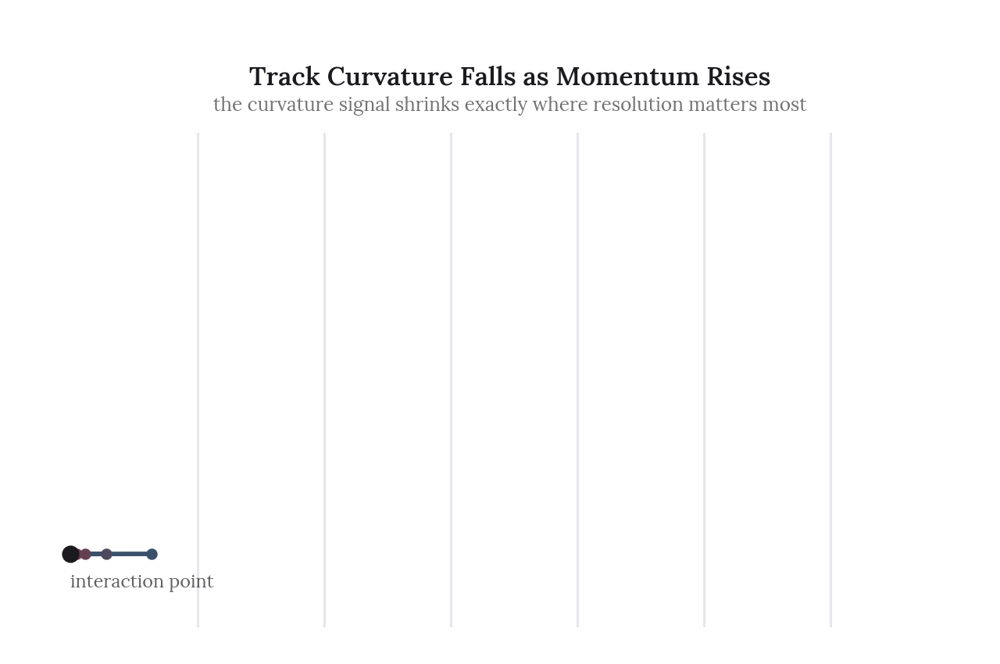
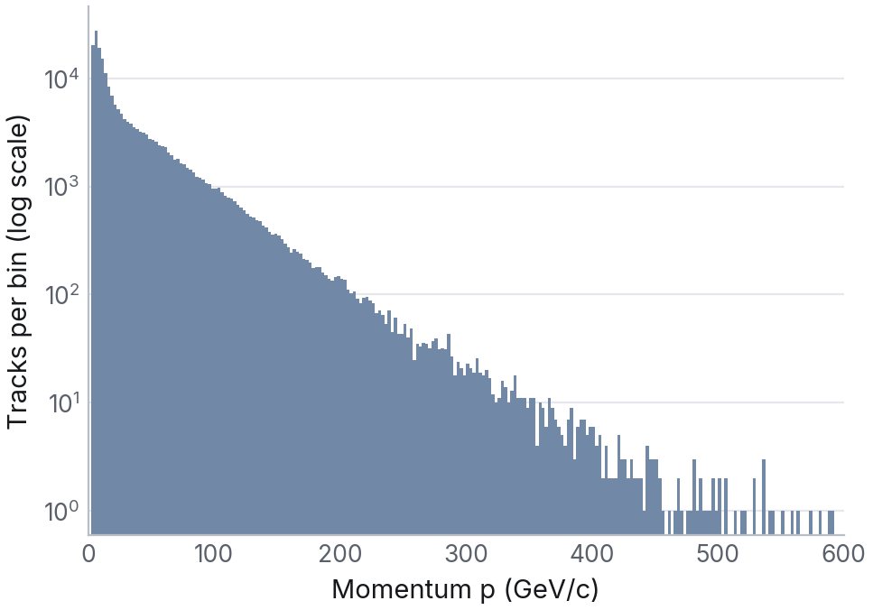
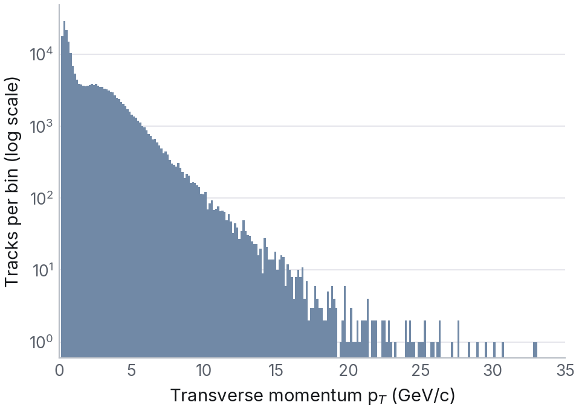
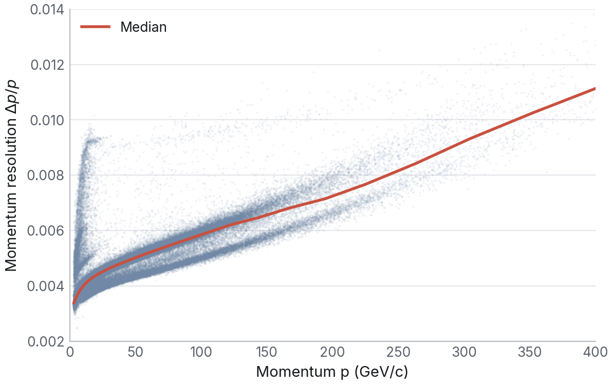
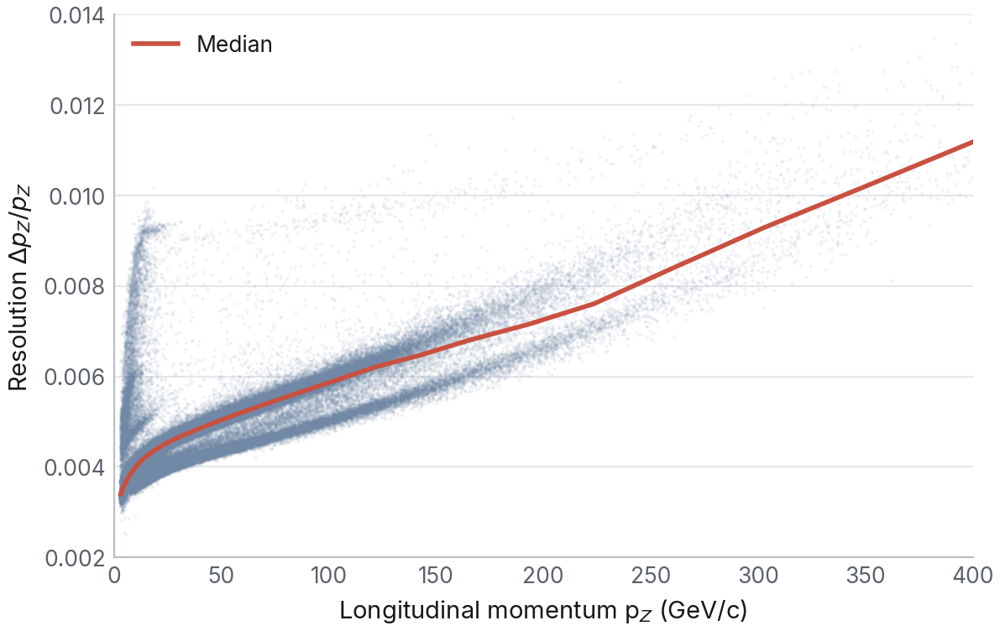
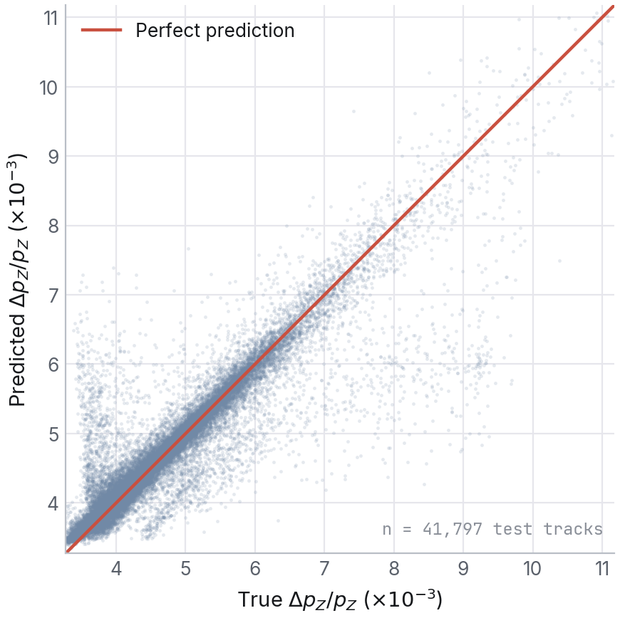
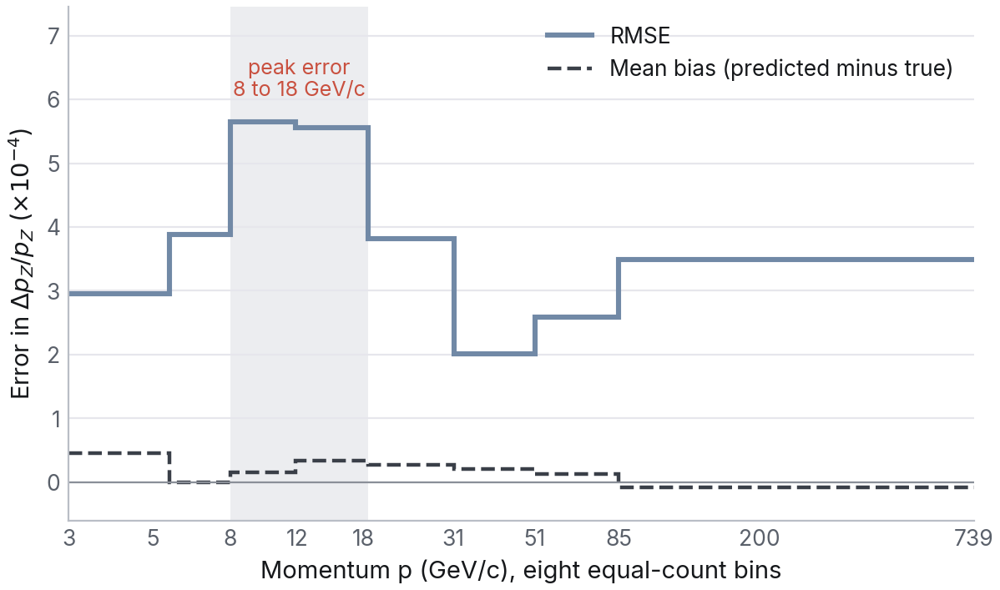

::: {.cs-top}
::: {.cs-keys}
::: {.cs-key}
[The Decision]{.cs-label}

[Judge the model on a test set scored once, and set it against two baselines on the same split.]{.cs-decision}
:::

::: {.cs-key}
[Takeaways]{.cs-label}

- The final network reaches R² of 0.854 on 41,797 unseen tracks, against 0.698 for linear regression.
- Trained properly, model capacity is worth 0.105 of R². The original notebook put it near 0.015.
- Error peaks at 8 to 18 GeV/c, where a forward, low-momentum population overlaps the main band.
:::
:::
:::

This project predicts the momentum resolution of muon tracks in a particle detector from five kinematic inputs: total momentum $p$, track slopes $t_x$ and $t_y$, pseudorapidity $\eta$ and azimuthal angle $\phi$. The muons come from simulated $\chi_{c1} \rightarrow J/\psi\,\gamma$ decays, with $J/\psi \rightarrow \mu^+\mu^-$, giving 208,984 reconstructed tracks.

The final model reaches an $R^2$ of **0.854** on a held-out test set of 41,797 tracks, scored once. Linear regression reaches 0.698 on the same split.

{fig-alt="Animated schematic of six muon tracks leaving an interaction point, labelled 5 to 340 GeV/c. The 5 GeV/c track bends sharply upward and the 340 GeV/c track is almost straight." fig-align="center" width="90%"}

A charged track bends in a magnetic field with a radius proportional to its momentum. The highest momentum tracks are nearly straight, so the curvature that momentum is inferred from is weakest where precision matters most.

**Source code**: [github.com/olivia-jackson-lambert/muon-momentum-regression-model](https://github.com/olivia-jackson-lambert/muon-momentum-regression-model)

# Data Exploration

Momentum spans a wide range. Transverse momentum $p_t$ is concentrated at low values.

::: {.columns}
::: {.column width="48%"}
{fig-alt="Histogram of total momentum from 0 to 600 GeV/c on a log count scale. Counts fall steadily as momentum rises."}
:::
::: {.column width="4%"}
:::
::: {.column width="48%"}
{fig-alt="Histogram of transverse momentum from 0 to 35 GeV/c on a log count scale. Counts peak below 1 GeV/c and fall steeply beyond 5 GeV/c."}
:::
:::

The longitudinal component follows from $p_z = \sqrt{p^2 - p_t^2}$, which gives the target resolution ratio $\Delta p_z / p_z$.

{fig-alt="Scatter of momentum resolution against momentum from 0 to 400 GeV/c with a rising median line. A narrow spike of tracks below 25 GeV/c climbs to about 0.0095, well above the main band. At higher momentum the main band splits into two branches." fig-align="center" width="88%"}

Resolution degrades steadily with momentum, as expected. Faster tracks bend less, so their curvature is harder to measure. The median line shows the trend through the dense region.

The more interesting feature is a **secondary cluster** well above the main band between roughly 10 and 25 GeV/c. It reaches resolutions near 0.0095 where the main band sits around 0.0045. At higher momentum the main band also splits into two branches. The population is not unimodal, and that limits what the model can be expected to do.

{fig-alt="Scatter of longitudinal momentum resolution against longitudinal momentum, showing the same spike below 25 GeV/c and the same split into two branches at higher momentum." fig-align="center" width="88%"}

Taking the tracks between 8 and 25 GeV/c and splitting them at a resolution of 0.0070 isolates the upper cluster. It holds 1,410 tracks, 2.1 percent of the band, and two variables separate it almost completely:

| Variable | Upper cluster | Main band | Cohen's $d$ |
|---|--:|--:|--:|
| $\eta$ | 4.48 | 3.54 | **+2.21** |
| $p_t$ | 0.288 | 1.002 | **-1.31** |
| $t_x$, $t_y$, $z_V$, pol, $\phi$ | | | 0.06 or less |

These are very forward tracks, with a mean $\eta$ of 4.48 against a dataset median of 3.53, and they carry very little transverse momentum. A track travelling almost along the beam axis crosses less of the magnetic field. Its bending lever arm is short, so its momentum is measured poorly even when its total momentum is ordinary. Nothing else in the feature set sets these tracks apart.

# Method

The evaluation is built to estimate how well the model does on tracks it has never seen.

- **Three-way split** of 60, 20 and 20 percent into train (125,390), validation (41,797) and test (41,797). Models are selected on validation. The test split is scored once, at the end.
- **Scaling is fit on the training split only**, so no statistics leak from the validation or test data into the scores.
- **Two reference points** are scored on the same split: predicting the training mean, and linear regression. They give an $R^2$ of 0.85 its context.
- **The target is standardised as well as the features.** $\Delta p_z / p_z$ is of order $10^{-3}$. In raw units the squared-error gradients are so small that the networks never converge.

# Results

| Model | Validation $R^2$ | RMSE | MAE |
|---|--:|--:|--:|
| Mean baseline | 0.000 | 1.046e-3 | 7.573e-4 |
| Linear regression | 0.698 | 5.751e-4 | 3.491e-4 |
| MLP, 5 units | 0.753 | 5.194e-4 | 2.694e-4 |
| MLP, 5 and 3 units | 0.785 | 4.848e-4 | 2.375e-4 |
| MLP, 10 units | 0.797 | 4.713e-4 | 2.281e-4 |
| **MLP, 40 and 5 units** | **0.858** | **3.947e-4** | **1.805e-4** |

On the held-out test set the selected model scores $R^2$ of 0.854, RMSE of 3.938e-4 and MAE of 1.783e-4. Validation and test $R^2$ differ by 0.003, so model selection did not overfit the validation split.

Linear regression already captures most of the signal at 0.698. The network adds 0.160 on validation. That gain is worth having, and it refines a relationship that is largely linear to begin with.

{fig-alt="Scatter of predicted against true longitudinal momentum resolution for 41,797 test tracks, with a diagonal line for perfect prediction. Points hug the line below 7 times 10 to the minus 3 and spread out above it, with a small group near 9 times 10 to the minus 3 predicted well below the line." fig-align="center" width="72%"}

Predictions follow the diagonal closely through the dense region below 0.007. Above that the scatter widens. A visible tail of points sits well below the line, where the model under-predicts resolution for tracks that are genuinely poorly measured.

# Where the Model Fails

I binned the test error by momentum to see where the model struggles. The answer does not match the curvature argument.

{fig-alt="Step chart of test RMSE and mean bias across eight equal-count momentum bins from 3 to 739 GeV/c. RMSE peaks at about 5.6 times 10 to the minus 4 between 8 and 18 GeV/c and is lowest at 2.0 times 10 to the minus 4 between 31 and 51 GeV/c. Bias stays close to zero throughout." fig-align="center" width="85%"}

| p range (GeV/c) | n | RMSE | Mean bias |
|---|--:|--:|--:|
| 3.0 to 5.5 | 5,225 | 2.95e-4 | +4.5e-5 |
| 5.5 to 8.0 | 5,224 | 3.88e-4 | +3.9e-7 |
| **8.0 to 11.9** | 5,225 | **5.65e-4** | +1.5e-5 |
| **11.9 to 18.5** | 5,224 | **5.56e-4** | +3.4e-5 |
| 18.5 to 31.2 | 5,225 | 3.82e-4 | +2.8e-5 |
| **31.2 to 51.1** | 5,224 | **2.02e-4** | +2.1e-5 |
| 51.1 to 85.0 | 5,225 | 2.58e-4 | +1.3e-5 |
| 85.0 to 739 | 5,225 | 3.49e-4 | -8.1e-6 |

Error peaks at 8 to 18 GeV/c at roughly 5.6e-4. It is lowest at 31 to 51 GeV/c at 2.0e-4, almost three times better. The high momentum tail is not the worst region, which the curvature argument alone would predict it to be.

The peak falls in the same momentum range as the high-$\eta$ cluster found above. Two populations with very different resolutions overlap there. The model does receive $\eta$ and $p_t$, but the minority population is only about 2 percent of the band, so the network averages across the boundary and never cleanly separates the two regimes. This is a strong candidate explanation. I have not yet shown it, and it is directly testable by scoring the two clusters separately.

Bias stays small and positive across almost the whole range and turns slightly negative only in the highest bin. The model mildly over-estimates resolution at low and middle momenta, and is slightly optimistic for the straightest tracks.

# What Changed From the Original Notebook

The original analysis reported a cross-validated $R^2$ of 0.734. It concluded that feature scaling mattered far more than architecture, since the model variants sat within about 0.015 of each other. Re-running the analysis changes that conclusion.

With target standardisation and early stopping in place, the architectures separate clearly, from 0.753 at five units to 0.858 at forty. Capacity is worth roughly 0.105 of $R^2$. The original ran a fixed 50 epochs with no early stopping and no target scaling, so the larger networks never converged and looked no better than the small ones.

Scaling the inputs is still the most important preprocessing step. Architecture matters too.

The original notebook also imports `tensorflow.keras.wrappers.scikit_learn.KerasRegressor`, which was deprecated in TensorFlow 2.6 and removed in 2.13, so it no longer runs on current TensorFlow. I rebuilt the pipeline on scikit-learn, which expresses the same dense architectures without that dependency.

# Limitations

**The architecture search is shallow.** I tried four hand-chosen configurations. The trend suggests wider networks would keep improving, and I have not tested where that stops.

**Only kinematic inputs are used.** Detector geometry, hit multiplicity and track fit quality are all absent. The mid-momentum error peak looks at least partly like a forward-track effect that $\eta$ and $p_t$ already encode. A genuine acceptance or reconstruction variable would likely separate the populations more cleanly.

**The data is simulation.** These are Monte Carlo tracks, so the model has learned how a detector simulation behaves. Real detector data may differ.

# Next Steps

**Test the high-$\eta$ explanation.** Score the forward, low-$p_t$ cluster separately from the main band. If it carries most of the error at 8 to 18 GeV/c, a sample weight or a dedicated model for forward tracks is the fix. Adding capacity everywhere would not target it.

**Extend the architecture sweep.** Continue past forty units to find where the gains flatten.

**Predict the full distribution.** Quantile regression would give each track an uncertainty band instead of a single point estimate. For a quantity that is itself a measure of uncertainty, that is more useful than a mean.
