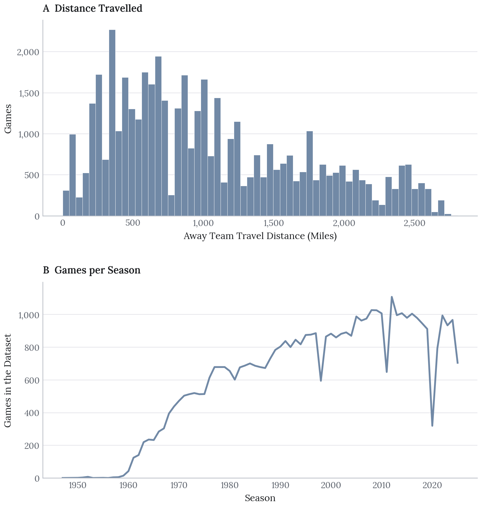
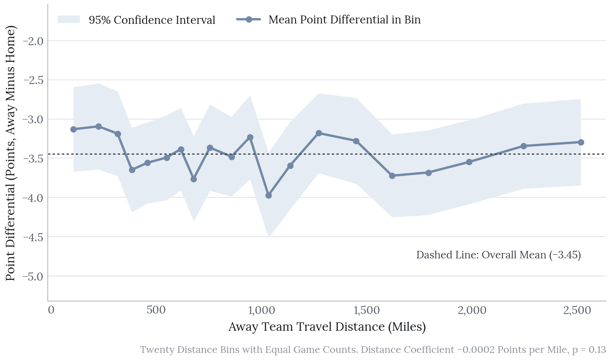
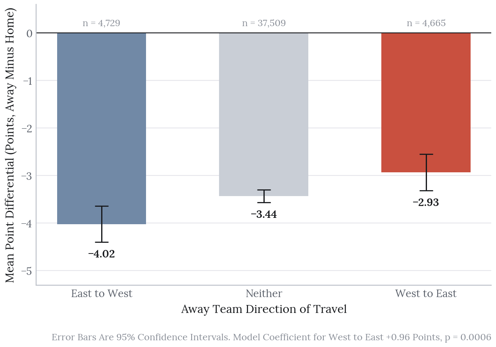
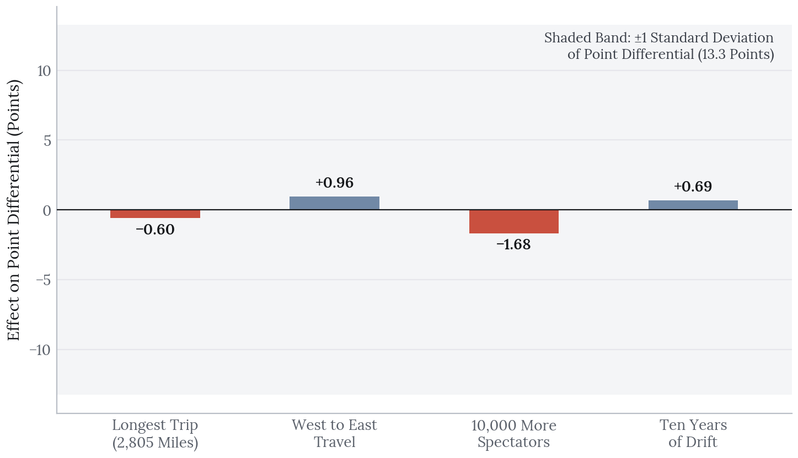

::: {.cs-top}
[In collaboration with Afrah Boateng, Mackenzie Henderson and Tyler Kero]{.cs-with}

::: {.cs-keys}
::: {.cs-key}
[The Decision]{.cs-label}

[Report effect sizes alongside significance, because at 46,903 games almost everything is significant.]{.cs-decision}
:::

::: {.cs-key}
[Takeaways]{.cs-label}

- Travel distance has no detectable effect on point differential.
- Flying west to east is worth about a point. The reverse trip is worth nothing.
- The model explains 0.5% of the variance, so every effect is small against game-to-game noise.
:::
:::
:::

Travel is the usual explanation for why away teams underperform. Long flights, lost sleep, time zones. We tested whether the distance an NBA away team travels shows up in the final score, using 46,903 regular season games from 1947 to 2025.

It does not. The distance coefficient is indistinguishable from zero. The direction of travel does show up. Teams flying west to east gain close to a point, and the same trip in reverse gains nothing. Time zones matter here and mileage does not.

# The Question

Does the distance an away team travels affect point differential, measured as away score minus home score?

Our starting point was Deddens and Steenland (1997), who found limited effects of travel distance on NBA performance. We revisited the question with a much larger dataset, large enough to detect a small effect if one exists.

# The Data

We built the dataset from Kaggle's NBA box score archive. Each row is one regular season game, joined to the geodesic distance between the two teams' cities.

| | |
|---|---|
| Games | 46,903 |
| Seasons | 1947 to 2025 |
| Mean point differential | -3.45 (home advantage) |
| Standard deviation | 13.26 |
| Median travel distance | 896 miles |
| Longest trip | 2,805 miles |

{fig-alt="Two stacked panels. Top, a histogram of away team travel distance, concentrated under 1,250 miles and tailing off to about 2,800. Bottom, games per season, near zero before 1960, rising to roughly 1,000 per season by the 2000s, with dips in some seasons." width="82%"}

Coverage is uneven. Only 45 games predate 1960, and 95% come from 1970 onward.

We coded travel direction into three groups from the time zones of the two cities: West to East, East to West, and Neither, where both teams sit in the same zone. Neither is the reference category and covers 37,509 games.

Keep the standard deviation of 13.26 points in mind. Every effect below should be measured against it.

# Models

We fitted four nested linear models, each adding one term, with heteroskedasticity-robust standard errors:

1. Point differential on travel distance alone
2. Adding travel direction
3. Adding game attendance
4. Adding year

Robust standard errors matter because the variance of point differential is not constant across the decades the sample covers.

# The Null Result

{fig-alt="Mean point differential in twenty distance bins from about 100 to 2,500 miles. The line moves between about -4.0 and -3.1 with no trend, and the 95% confidence band covers the overall mean of -3.45 almost everywhere." width="100%"}

Binning games by travel distance and plotting the mean point differential in each bin gives a flat line. The confidence band covers the overall mean almost everywhere.

The regression agrees. The distance coefficient is -0.0002 points per mile with a p-value of 0.13. Taken at face value, the longest trip in the dataset, 2,805 miles, would cost the away team 0.6 points. Against a standard deviation of 13.26, that is nothing.

A null result on 46,903 games is a strong one. An effect of practical size would have shown up.

# What Does Show Up

{fig-alt="Bar chart of mean point differential by travel direction with 95% confidence intervals. East to West -4.02 (4,729 games), Neither -3.44 (37,509 games), West to East -2.93 (4,665 games)." width="92%"}

Direction separates games where distance does not. In the full model, teams travelling west to east gain 0.96 points relative to teams that stay in their time zone (p = 0.0006). Teams travelling east to west show -0.10 points (p = 0.72), which is no effect.

The asymmetry is the interesting part. If travel simply tired teams out, both directions would hurt, and longer flights would hurt more. Instead one direction helps and the other does nothing. That pattern fits circadian timing. For a team flying west to east, an evening tip-off falls earlier on its body clock, closer to the late afternoon peak that the sleep research we cite links to athletic performance.

Attendance and year are also significant. An extra 10,000 spectators is associated with 1.7 points against the away team. Point differential has moved about 0.7 points per decade in the away team's favour.

# Everything Is Significant and Almost Nothing Is Large

{fig-alt="Bar chart of four effects in points: longest trip -0.60, West to East travel +0.96, 10,000 more spectators -1.68, ten years of drift +0.69. All bars sit close to zero inside a shaded band spanning plus and minus 13.3 points." width="100%"}

This is the most important figure here. The original course report did not include it.

At 46,903 games, almost any effect reaches significance. Three of the four terms in the final model have p-values below 0.001. Plotted against the real spread of game outcomes, every one of them is small. The largest, 10,000 extra fans in the building, moves the expected margin by 1.7 points. Game-to-game variation is 13.3.

The model's adjusted R-squared is 0.0053. It explains half a percent of the variance in point differential. The F-test is overwhelmingly significant, and the model is close to useless for prediction. Both are true.

So the associations are real and they are tiny. Reporting p-values without effect sizes would mislead, which is why we made this figure.

# Limitations

**The analysis is descriptive.** It supports no causal claims. Games are not independent. Team quality persists across a season, injuries cluster, and league dynamics shift. Year as a numeric covariate captures long-run drift but not correlation within a team or season. The coefficients are average associations.

**Distance is not fatigue.** Geodesic distance measures how far apart two cities are. It says nothing about rest days, back-to-back games, travel conditions or sleep lost. The direction result hints at a circadian mechanism, and none of our variables measure that directly.

**The sample spans a long, changing era.** Court standards, player movement and the comfort of travel have all changed since 1947. The link between travel and outcome is unlikely to have held steady, yet the model fits one coefficient to all of it.

**Distance and direction overlap.** Long trips are mostly cross-country trips, so the two variables carry shared information. Read their separate coefficients with that in mind.

# Next Steps

**Model rest directly.** Days since the last game, and whether it was a back-to-back, are the variables most likely to carry the fatigue effect that distance stands in for.

**Count time zones crossed.** The direction result suggests zone changes are what matters. A signed count of zones crossed would test that against distance head on.

**Let the effect vary by era.** Interacting the travel terms with decade would show whether the effect has weakened as travel has become easier.

**Cluster the standard errors.** Robust errors handle non-constant variance but not dependence between games involving the same team. Clustering by team or season would give more honest intervals.
