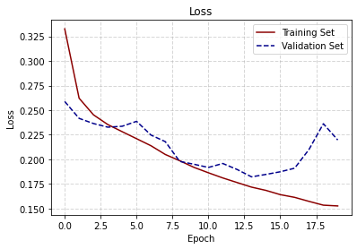
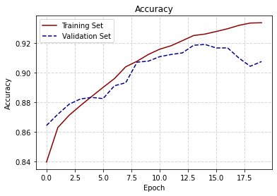
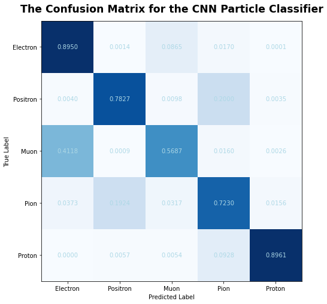

::: {.callout-note}

:::

## Overview

I built a convolutional neural network (CNN) to classify particle types from detector-like image representations.
The goal was to learn discriminative spatial patterns and evaluate performance by class (not just overall accuracy).

**What’s on this page**
- Problem framing + approach
- Training curves (loss and accuracy)
- Confusion matrix (per-class performance)

## Approach

- **Model:** CNN for multi-class classification
- **Training:** standard supervised learning with a train/validation split and early stopping/checkpointing (from the notebook workflow)
- **Evaluation:** accuracy over epochs + confusion matrix to understand which classes are most often confused

## Results

### Training curves

The model learns quickly in the early epochs, with training/validation accuracy stabilizing after ~10–15 epochs.

{fig-alt="Training and validation loss over epochs" width="650"}

{fig-alt="Training and validation accuracy over epochs" width="650"}

### Confusion matrix

The confusion matrix below shows where the model performs well and where it struggles.
Some particle types are consistently easier to identify, while others are more frequently confused.

{fig-alt="Confusion matrix for particle classifier" width="700"}

## Notes and next improvements

If I were iterating on this further, I would focus on:
- class-conditional performance (precision/recall per class) and calibration
- data augmentation or class rebalancing if classes are uneven
- architecture tweaks (regularization, deeper blocks) and systematic hyperparameter search
- adding Grad-CAM / saliency maps to interpret what regions drive predictions

### Reproducibility

