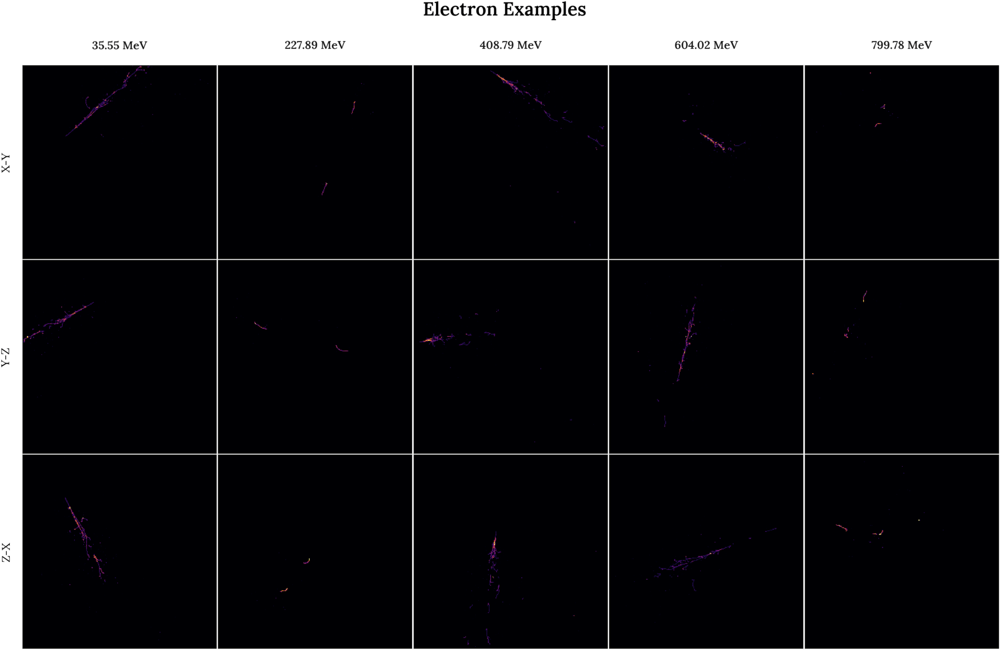
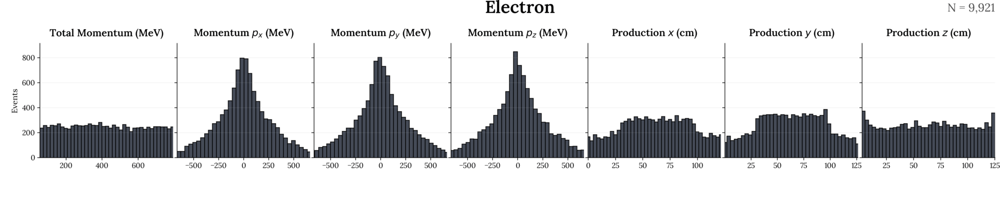
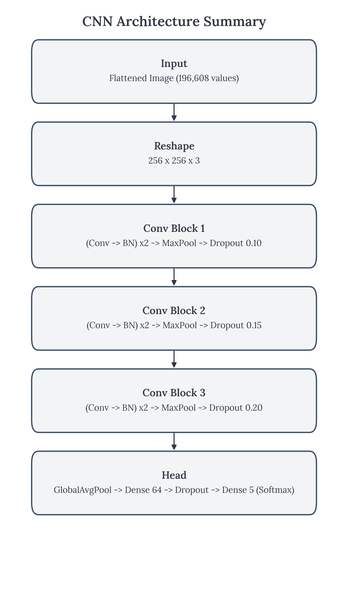
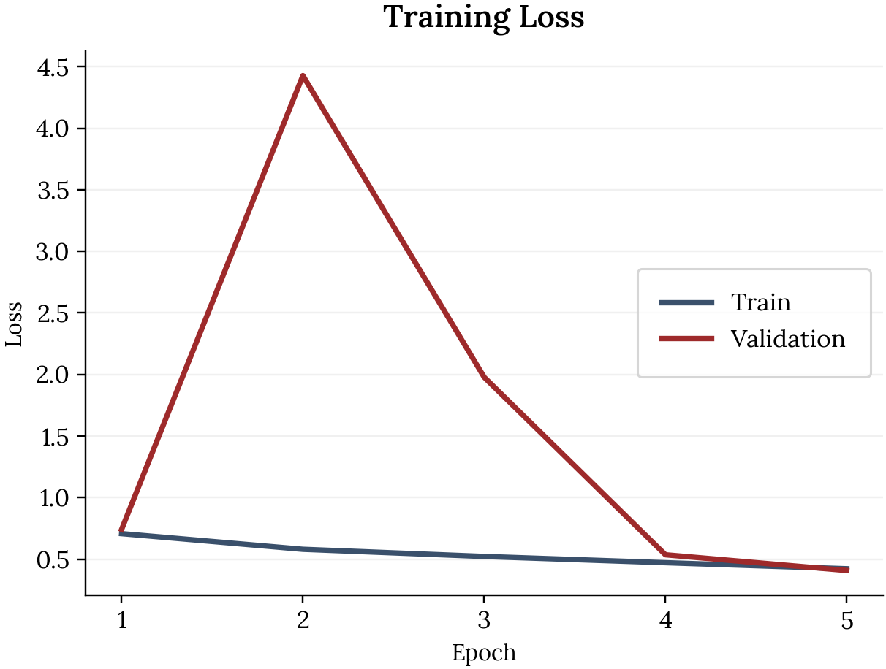
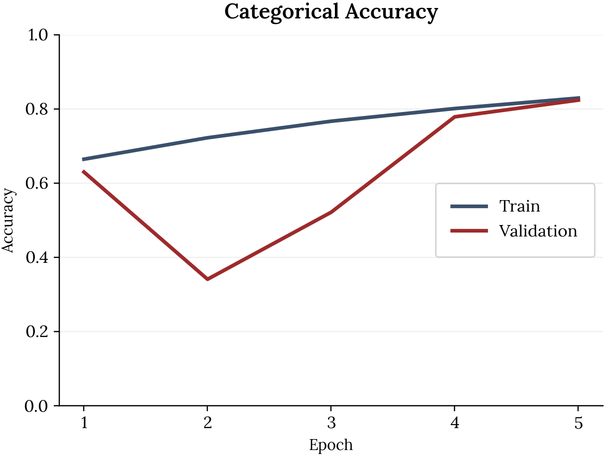
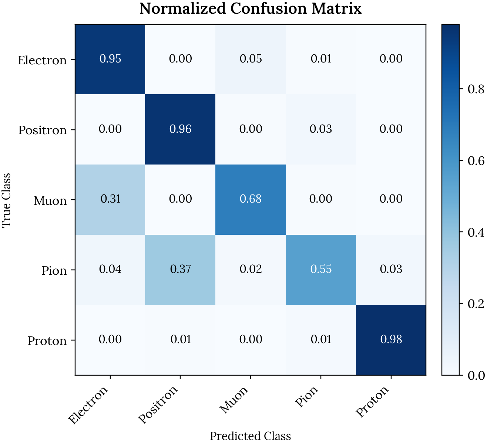
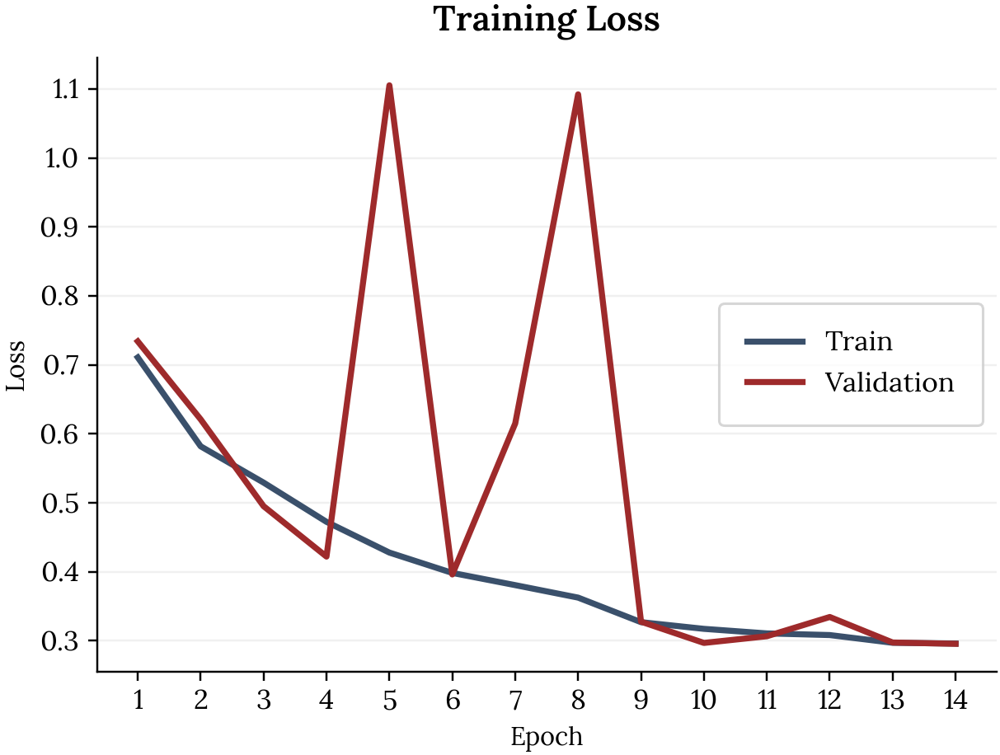
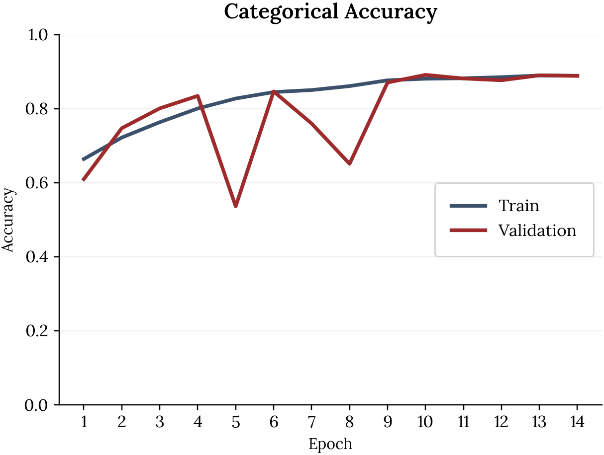
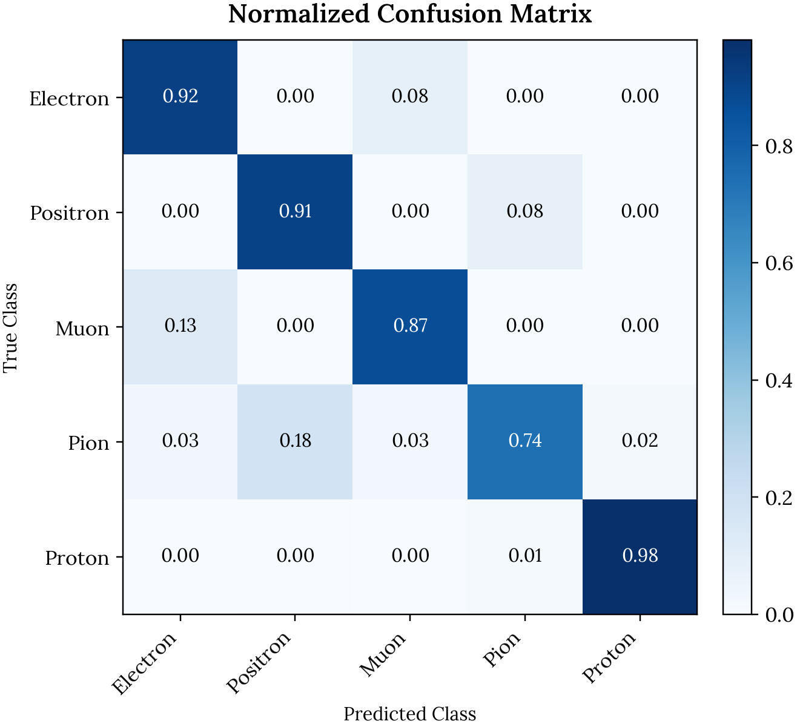
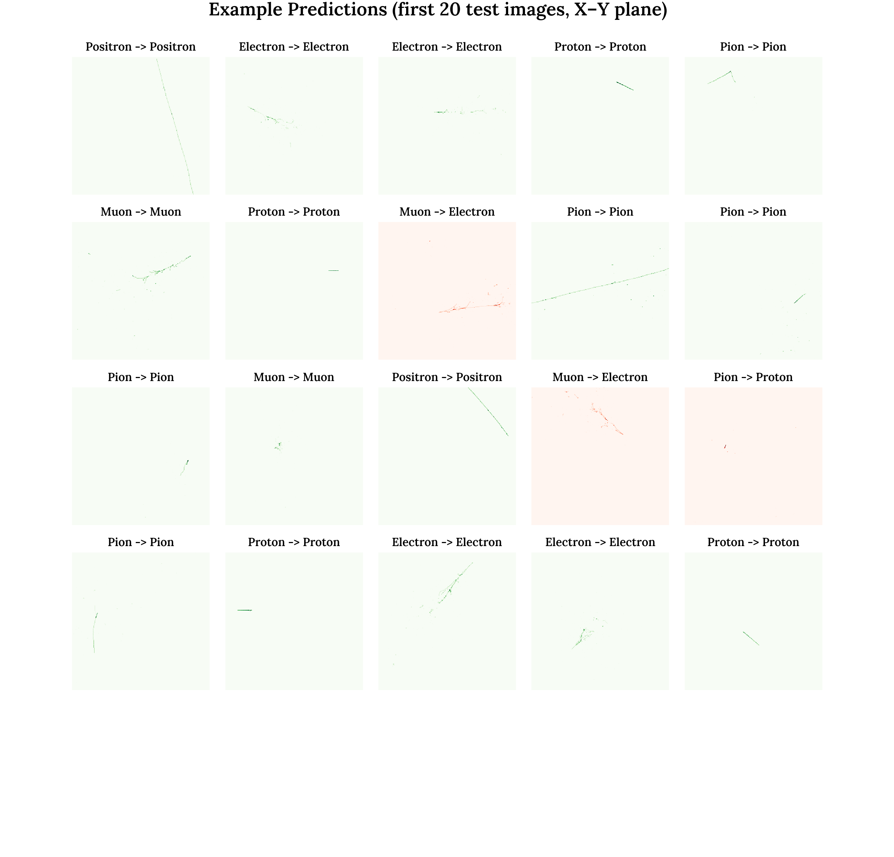

This project is inspired by the MicroBooNE Collaboration’s work on using convolutional neural networks (CNNs) to identify particle types from detector images. Their results showed that CNNs can learn the visual patterns in these images directly, without relying on hand-engineered physics rules, which makes the approach both scalable and reproducible. I used the paper’s model as a starting point because it provides a proven baseline for this exact kind of data, then iterated on the architecture to better fit my dataset and compute constraints, including changes to the filter widths, regularization, pooling strategy, and training setup. The goal of my project is to replicate the core idea in a simplified setting, validate the approach end-to-end, and evaluate which design choices actually matter for performance.

# Data Exploration

## Particle Types in the Dataset

This dataset contains five charged particle types commonly observed in liquid argon time projection chambers. Each particle differs in mass and electric charge, which strongly influences its track morphology in the detector.

| Particle  | Symbol | Charge (e) | Mass (MeV/c²) | Typical detector signature |
|----------|--------|------------|---------------|----------------------------|
| Electron | e⁻     | −1         | 0.511         | Light, long, branching tracks |
| Positron | e⁺     | +1         | 0.511         | Similar topology to electrons |
| Muon     | μ⁻     | −1         | 105.7         | Long, straight, penetrating tracks |
| Pion     | π⁺     | +1         | 139.6         | Moderately long, hadronic tracks |
| Proton   | p      | +1         | 938.3         | Short tracks with dense energy deposition |

## Example Particle Tracks Across the Momentum Range

The figure below shows example detector images for each particle type, ordered by increasing initial momentum from left to right. Each column corresponds to a different momentum value, while rows show the three detector projections (X–Y, Y–Z, Z–X). Examples were selected by grouping events by particle type and choosing evenly spaced momentum values, ensuring the visualizations capture behavior across the full energy range rather than a narrow subset of events.

While many tracks appear visually similar, consistent differences emerge. Higher-mass particles tend to produce shorter, denser tracks, while lighter particles travel farther and scatter more. Branching is visible across all classes but occurs less frequently for electrons and muons. These subtle spatial patterns motivate the use of convolutional neural networks, which are well suited to learning geometric differences in detector images.

{fig-alt="Example particle tracks at different initial momentums by type" width="1000"}

## Truth-Level Feature Distributions

The figure below summarizes the **truth-level kinematic and spatial features** associated with each particle class. These quantities accompany every detector image and provide physical context for the observed particle trajectories.

The momentum components $p_x$, $p_y$, and $p_z$ are symmetric around zero, reflecting the fact that particle directions are equally likely to be positive or negative along each axis. The **total momentum** is strictly positive and is defined as

$$
p = \sqrt{p_x^2 + p_y^2 + p_z^2}.
$$

As a result, its distribution spans a broad range of values that increases with particle energy.

The production coordinates \( $x, y, z$ \) exhibit bounded, approximately uniform distributions. These shapes are primarily determined by the detector geometry rather than by the underlying particle dynamics.

Histograms of each particle type are shown with a shared y-axis scale to enable direct comparison across features. Together, these distributions highlight which aspects of the truth data encode meaningful physical structure and motivate the feature representations used for downstream classification.

{fig-alt="Truth arrays by particle type" width="1000"}

# Initial Model
## Approach & Architecture
::: {.columns}

::: {.column width="45%"}
- **Model:** CNN for multi-class classification
- **Training:** standard supervised learning with a train/validation split and early stopping/checkpointing (from the notebook workflow)
- **Evaluation:** accuracy over epochs + confusion matrix to understand which classes are most often confused
:::
::: {.column width="5%"}
:::
::: {.column width="50%"}
{fig-alt="Example particle tracks at different initial momentums by type" width="1000"}
:::

:::

## Initial Model Performance

### Training Dynamics

The plots below show how the CNN learns over the first five training epochs.

#### Key observations
- Training loss decreases steadily, indicating that the model is learning meaningful features.
- Validation loss spikes early on, then stabilizes and moves closer to the training loss.
- Training and validation accuracy both increase with each epoch.
- By the final epoch, training and validation accuracy are similar, suggesting limited overfitting at this stage.

Overall, the model learns quickly and remains stable despite the short training run. The final cateogrical accuracy is 82.9% and the validation accuracy is 82.4%. 

::: {.columns}

::: {.column width="45%"}
{fig-alt="Training and validation loss over epochs"}
:::
::: {.column width="5%"}
:::
::: {.column width="45%"}
{fig-alt="Training and validation accuracy over epochs"}
:::

:::

### Classification Performance
::: {.columns}

::: {.column width="45%"}
The normalized confusion matrix summarizes how well the model distinguishes between particle types.

#### Key observations
- Electrons, positrons, and protons are classified with high accuracy.
- Muons and pions show increased confusion with other particle types.
- Most misclassifications occur between physically similar particles.

These errors are expected, as particle tracks can appear similar depending on energy and interaction patterns. The confusion matrix highlights both the strengths of the current architecture and the particle classes that would benefit most from further refinement.

:::
::: {.column width="5%"}
:::
::: {.column width="50%"}
{fig-alt="Normalized confusion matrix for particle classifier" width="700"}
:::

:::

# Hyperparameter Optimization
###
First round explain

### First Round Results

A first round of hyperparameter optimisation was performed to assess the sensitivity of the model to architectural and optimisation choices. Across all experiments, the learning rate had the strongest influence on validation performance. Increasing the learning rate improved both convergence speed and final accuracy, with the best-performing configuration reaching a validation accuracy of 83.2%.

In contrast, increasing model capacity through wider convolutional filters or larger dense layers did not yield consistent improvements, suggesting that the baseline architecture was already sufficiently expressive. Adjustments to regularisation strength showed that the model was not strongly overfitting, while the removal of batch normalization significantly degraded performance. These results indicate that further gains are more likely to come from optimisation strategies rather than architectural complexity.

Each model was set to run for a maximum of 30 epochs, but most converged after 4-5. This indicates that the dominant discriminative features are learned within only a few epochs, suggesting that the convolutional architecture is well matched to the structure of the particle track images and that performance is primarily limited by the available information in the data rather than model capacity.

The table below summarizes the performance of each configuration tested during hyperparameter optimization. Models are ranked by their best validation categorical accuracy.

| Configuration          | Key Change                              | Best Validation Accuracy | Final Validation Loss |
|------------------------|------------------------------------------|--------------------------|-----------------------|
| **Higher learning rate** | Increased learning rate (2e-3) | **0.832** | **0.410** |
| Less dropout            | Reduced dropout regularization            | 0.814 | 0.462 |
| Baseline                | Reference architecture                    | 0.813 | 0.464 |
| Average pooling         | Replaced max pooling with average pooling | 0.806 | 0.458 |
| More dropout            | Increased dropout regularization          | 0.790 | 0.501 |
| Wider filters           | Increased convolutional filters           | 0.782 | 0.481 |
| No batch normalization  | Removed batch normalization               | 0.763 | 0.525 |
| Larger dense head       | Increased dense layer width               | 0.759 | 0.515 |
| Lower learning rate     | Reduced learning rate (3e-4)              | 0.721 | 0.607 |

### Second Round Results

For the second round of optimization, three values of learning rate were explored, with the epochs set to 25. 

In the initial hyperparameter sweep, adaptive learning-rate scheduling was used to stabilize training across a wide range of architectural configurations. This allowed for efficient comparison of model capacity and regularization choices, though it means results reflect performance under an automatically tuned optimizer rather than fixed learning rates. Subsequent experiments explicitly isolate learning rate effects by disabling adaptive scheduling.

### Validation accuracy comparison: with vs without LR Plateau

| Initial learning rate | Best val acc (no LR plateau) | Best val acc (with LR plateau) | Δ (with − without) |
|----------------------|------------------------------|--------------------------------|--------------------|
| 1.0e−3 | 0.8344 | **0.8912** | +0.0568 |
| 1.2e−3 | 0.6792 | 0.7352 | +0.0560 |
| 1.5e−3 | 0.6332 | 0.8200 | +0.1868 |
| 2.0e−3 | 0.6538 | 0.8322 | +0.1784 |
| 3.0e−3 | 0.6408 | 0.8436 | +0.2028 |

# Final Model
## Performance Evaluation
### Training Dynamics
::: {.columns}

::: {.column width="45%"}
{fig-alt="Training and validation loss over epochs"}
:::
::: {.column width="5%"}
:::
::: {.column width="45%"}
{fig-alt="Training and validation accuracy over epochs"}
:::

:::

### Classification Performance

{fig-alt="Normalized confusion matrix for particle classifier" width="700"}
{fig-alt="Normalized confusion matrix for particle classifier" width="700"}

# Next Steps
