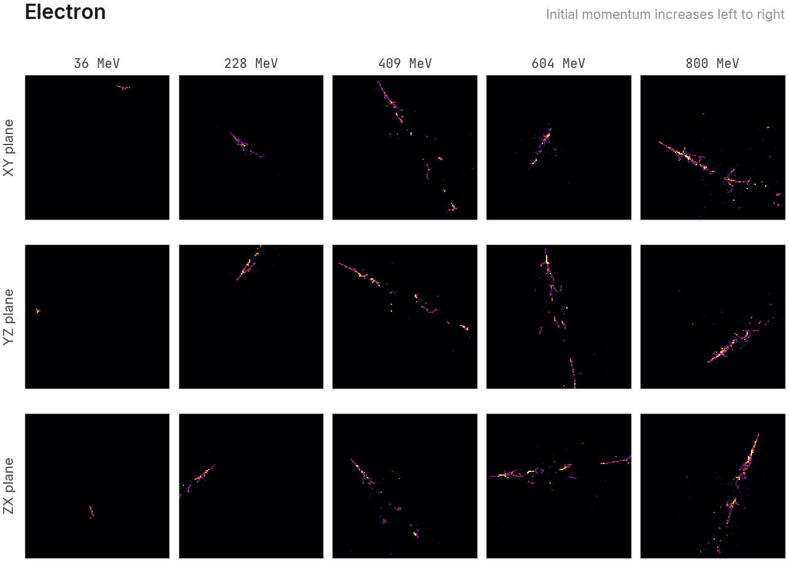
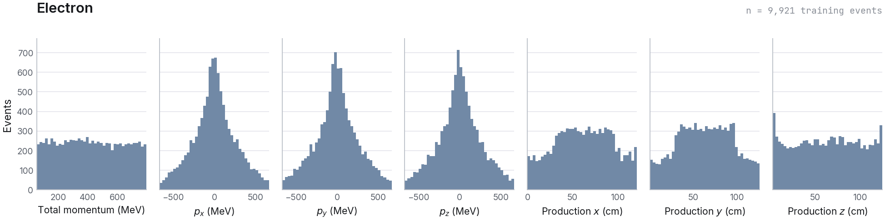
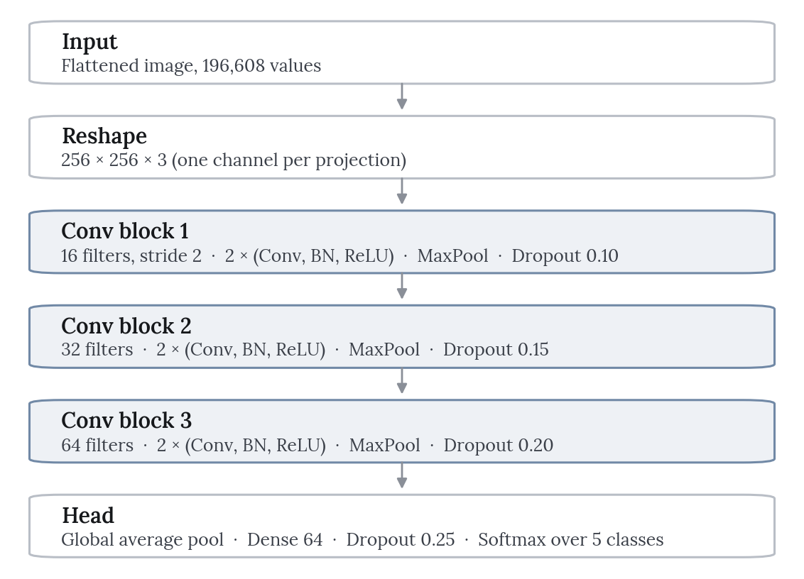
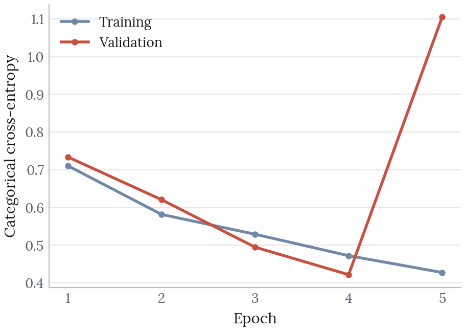
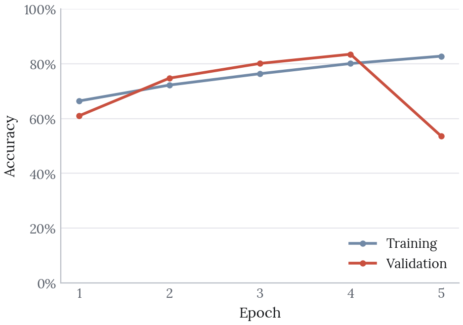
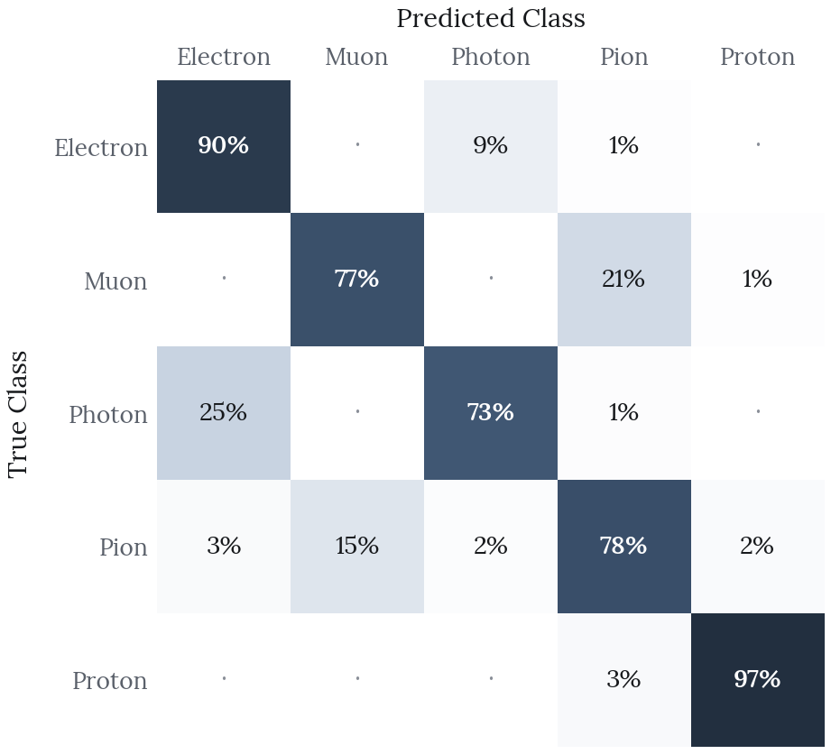
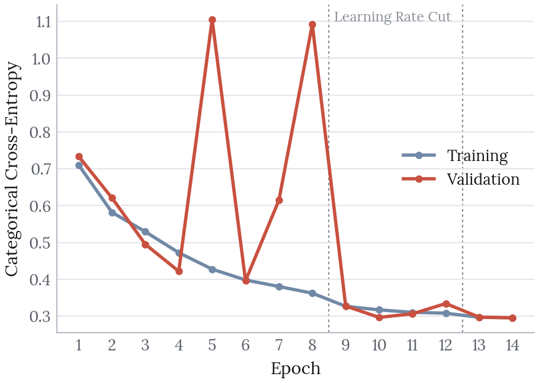
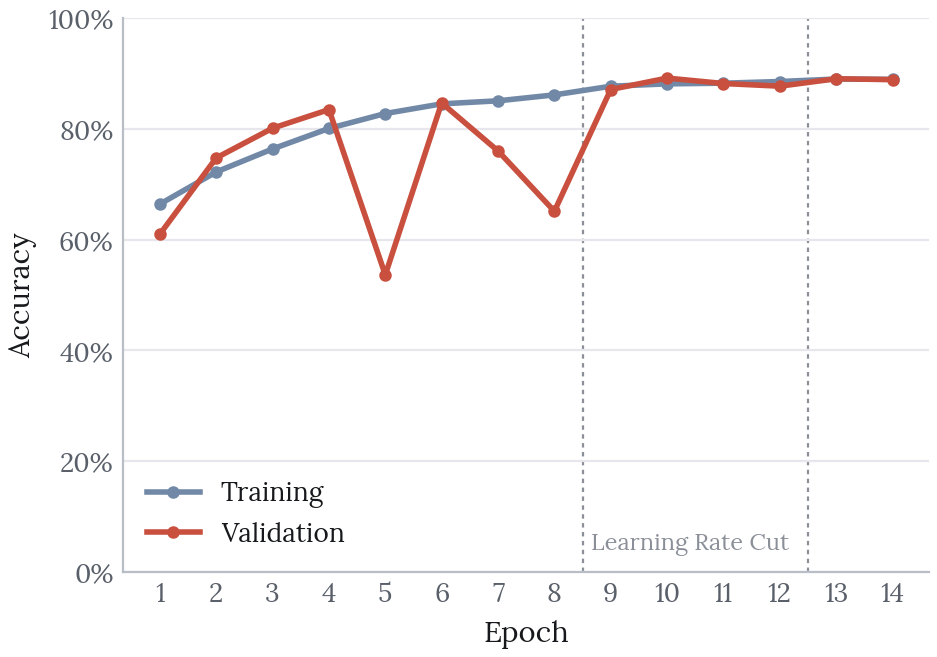
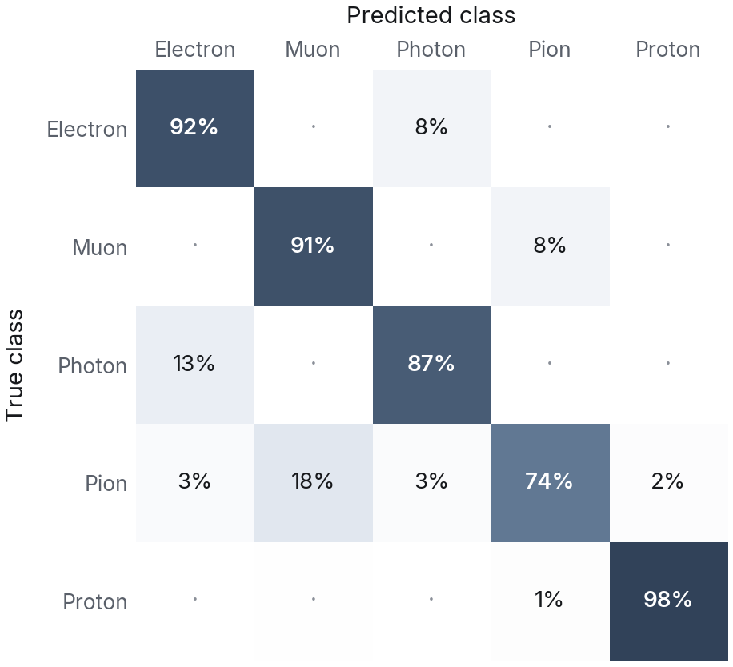
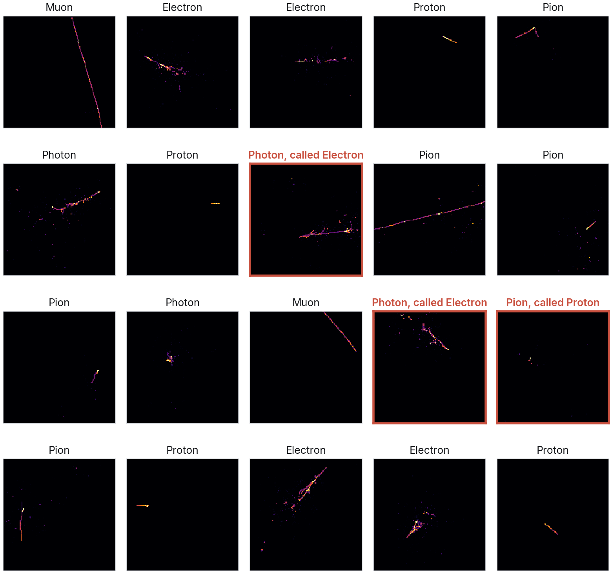

::: {.cs-top}
::: {.cs-keys}
::: {.cs-key}
[The Decision]{.cs-label}

[Tune the learning-rate schedule rather than the architecture.]{.cs-decision}
:::

::: {.cs-key}
[Takeaways]{.cs-label}

- Plateau learning-rate scheduling lifted best validation accuracy from 83.4% to 89.1%.
- On 40,000 held-out test events, accuracy rose from 82.9% to 88.2%.
- Adding capacity made the model worse. The baseline architecture was already expressive enough.
- Pions remain the weak class. About one in five is called a muon.
:::
:::
:::

This project identifies particles from liquid argon time projection chamber images. The dataset holds five classes: electrons, muons, photons, pions and protons. Following the MicroBooNE Collaboration's approach [1], a convolutional neural network learns track patterns directly from the images, with no hand-built physics rules. Most of the gain came from the learning-rate schedule. The final model reaches 89.1% validation accuracy and 88.2% on a held-out test set.

Source code: [github.com/olivia-jackson-lambert/high-energy-particle-classifier](https://github.com/olivia-jackson-lambert/high-energy-particle-classifier)

# Data Exploration

## Particle Types in the Dataset

The dataset has 90,000 simulated events, 18,000 for each class. Four classes are charged particles. The photon is neutral. Mass and charge shape how each particle looks in the detector.

| Particle | PDG code | Symbol | Charge (e) | Mass (MeV/c²) | Typical detector signature |
|----------|----------|--------|------------|---------------|----------------------------|
| Electron | 11       | e⁻     | −1         | 0.511         | Branching electromagnetic shower |
| Muon     | 13       | μ⁻     | −1         | 105.7         | Long, straight, penetrating track |
| Photon   | 22       | γ      | 0          | 0             | Electromagnetic shower, similar to an electron |
| Pion     | 211      | π⁺     | +1         | 139.6         | Moderately long hadronic track |
| Proton   | 2212     | p      | +1         | 938.3         | Short track with dense energy deposition |

I split the data into 50,000 training events and 40,000 test events. Of the training events, 5,000 are held back for validation.

## Example Particle Tracks Across the Momentum Range

Each event has three detector projections: the XY, YZ and ZX planes. The animation cycles through the five classes. Each frame shows five training events chosen to span the momentum range from lowest to highest.

Heavier particles leave shorter, denser tracks. Lighter particles travel farther and scatter more. Electrons and photons both shower, which makes them hard to tell apart by eye.

{fig-alt="Animated grid cycling through electron, muon, photon, pion and proton. Each frame shows five events of one class at increasing momentum, with the XY, YZ and ZX projections as rows. Muons and pions leave thin lines, protons short bright stubs, and electrons and photons branching showers." width="100%"}

## Truth-Level Feature Distributions

Each image comes with truth-level kinematics: total momentum, its three components, and the production point. The momentum components are symmetric around zero because particles leave in every direction. Total momentum is $p = \sqrt{p_x^2 + p_y^2 + p_z^2}$ and is spread fairly evenly across its range. The production coordinates are bounded by the detector volume.

{fig-alt="Animated row of seven histograms, one frame per particle type, for total momentum, the three momentum components and the three production coordinates. Momentum components peak at zero and are symmetric. Total momentum and production coordinates are broad and bounded." width="100%"}

# Initial Model

## Architecture

The network has three convolutional blocks. Each block runs two convolutions with batch normalization and ReLU, then max pooling and dropout. The filter count doubles from block to block, from 16 to 32 to 64.

Global average pooling reduces the final feature maps to a single vector. A small dense layer feeds a five-way softmax. The model has about 77,000 parameters, so it trains quickly while still having room to learn the track shapes.

{fig-alt="Stacked diagram of the network: flattened input of 196,608 values, reshape to 256 by 256 by 3, three convolutional blocks with 16, 32 and 64 filters, then a head of global average pooling, a 64-unit dense layer, dropout and a five-class softmax." fig-align="center" width="70%"}

## Initial Model Performance

### Training Dynamics

I trained the baseline for five epochs at a learning rate of 1e-3. A plateau scheduler was attached but never fired in that time. Training accuracy climbed steadily to 82.7%. Validation accuracy peaked at 83.4% in epoch 4, then fell to 53.6% in epoch 5. The saved checkpoint is the epoch 4 model, which scores 82.9% on the test set. That swing suggested the learning rate was too high for the model to settle.

::: {.columns}

::: {.column width="48%"}
{fig-alt="Line chart of training and validation loss over five epochs. Training loss falls steadily. Validation loss falls to 0.42 at epoch 4, then jumps to 1.1 at epoch 5."}
:::
::: {.column width="4%"}
:::
::: {.column width="48%"}
{fig-alt="Line chart of training and validation accuracy over five epochs. Training accuracy rises to 83%. Validation accuracy peaks at 83% at epoch 4 and drops to 54% at epoch 5."}
:::

:::

### Classification Performance

Protons and electrons are the easiest classes, at 97% and 90% recall on the test set. The errors follow the physics. A quarter of photons are called electrons, since both produce showers. Muons and pions leave similar thin tracks, and the model mixes them up in both directions.

{fig-alt="Row-normalized confusion matrix for the initial model on the test set. Diagonal: electron 90%, muon 77%, photon 73%, pion 78%, proton 97%. Largest errors: photon called electron 25%, muon called pion 21%, pion called muon 15%." fig-align="center" width="70%"}

# Hyperparameter Optimization

### First Round Results

The first sweep varied one choice at a time against the baseline. Learning rate had the largest effect. Raising it to 2e-3 gave the best validation accuracy of the round, 83.2%.

Wider filters and a larger dense head both made the model worse. Removing batch normalization cost five points. Changing dropout moved accuracy only slightly. Optimization looked like the better lever.

| Configuration          | Key Change                                | Best Validation Accuracy | Final Validation Loss |
|------------------------|-------------------------------------------|--------------------------|-----------------------|
| **Higher learning rate** | Learning rate raised to 2e-3            | **0.832** | **0.410** |
| Less dropout           | Reduced dropout                           | 0.814 | 0.462 |
| Baseline               | Reference architecture                    | 0.813 | 0.464 |
| Average pooling        | Average pooling in place of max pooling   | 0.806 | 0.458 |
| More dropout           | Increased dropout                         | 0.790 | 0.501 |
| Wider filters          | More convolutional filters                | 0.782 | 0.481 |
| No batch normalization | Batch normalization removed               | 0.763 | 0.525 |
| Larger dense head      | Wider dense layer                         | 0.759 | 0.515 |
| Lower learning rate    | Learning rate lowered to 3e-4             | 0.721 | 0.607 |

### Second Round Results

The second round tested initial learning rates between 1e-3 and 3e-3. The first sweep had used plateau scheduling, which cuts the learning rate when validation loss stops improving. I switched it off here to isolate the effect of the starting rate, then ran each rate again with it switched back on.

### Impact of Learning Rate Scheduling

Plateau scheduling improved every starting rate. The best configuration, 1e-3 with plateau scheduling, reached 89.1% validation accuracy. That is 5.7 points above the same rate without it.

| Initial learning rate | Best val acc (no plateau) | Best val acc (with plateau) | Improvement |
|-----------------------|---------------------------|-----------------------------|-------------|
| 1.0e-3 | 0.834 | **0.891** | +5.7pp |
| 1.2e-3 | 0.679 | 0.735 | +5.6pp |
| 1.5e-3 | 0.633 | 0.820 | +18.7pp |
| 2.0e-3 | 0.654 | 0.832 | +17.8pp |
| 3.0e-3 | 0.641 | 0.844 | +20.3pp |

# Final Model

## Performance Evaluation

### Training Dynamics

The final model trained for 14 epochs. Through epoch 8 the validation accuracy swung between 54% and 85%. The scheduler then cut the learning rate from 1e-3 to 2e-4 from epoch 9, and to 4e-5 from epoch 13. After the first cut, validation tracked training closely. Validation accuracy peaked at 89.1% in epoch 10, and that checkpoint is the final model.

::: {.columns}

::: {.column width="48%"}
{fig-alt="Line chart of training and validation loss over 14 epochs, with dotted lines marking learning-rate cuts before epochs 9 and 13. Validation loss spikes above 1.0 at epochs 5 and 8, then settles near 0.30 alongside training loss after the first cut."}
:::
::: {.column width="4%"}
:::
::: {.column width="48%"}
{fig-alt="Line chart of training and validation accuracy over 14 epochs, with dotted lines marking learning-rate cuts before epochs 9 and 13. Validation accuracy drops to 54% and 65% early on, then holds near 89% with training accuracy after the first cut."}
:::

:::

### Classification Performance

On the 40,000 test events the final model scores 88.2%, up 5.3 points from the initial model. Muon recall rose from 77% to 91% and photon recall from 73% to 87%. Pions did not improve. About 18% are still called muons, and that pair is the main remaining weakness.

{fig-alt="Row-normalized confusion matrix for the final model on the test set. Diagonal: electron 92%, muon 91%, photon 87%, pion 74%, proton 98%. Largest errors: pion called muon 18%, photon called electron 13%, electron called photon 8%, muon called pion 8%." fig-align="center" width="70%"}

The grid below shows the first 20 test events in the XY plane, unselected. Seventeen are correct. Two of the three errors are photons called electrons.

{fig-alt="Four by five grid of detector images in the XY plane, each titled with its true class. Seventeen are correct. Three misclassified panels are outlined in red: two photons called electrons and one pion called a proton." width="100%"}

# Next Steps

**Architecture.** Try residual networks or attention to separate pions from muons.

**Evaluation.** Add uncertainty estimates so low-confidence predictions can be flagged.

**Explainability.** Use Grad-CAM to show which parts of each image drive a prediction.

# References

[1] MicroBooNE Collaboration. "A Convolutional Neural Network for Multiple Particle Identification in the MicroBooNE Liquid Argon Time Projection Chamber." arXiv:2010.08653 (2020). [https://arxiv.org/abs/2010.08653](https://arxiv.org/abs/2010.08653)
