This project implements an end-to-end receipt processing system that combines optical character recognition (OCR) with a multi-task neural network for sentence classification and named entity recognition (NER). The system scans receipt images, extracts text using OCR, and then processes the text with a BGE-M3 transformer backbone to classify sentences and extract entities. By leveraging pre-trained sentence embeddings and joint optimization, the model learns shared representations that benefit both tasks.

**Source code**: [github.com/olivia-jackson-lambert/sentence-project](https://github.com/olivia-jackson-lambert/sentence-project)

::: {.callout-note appearance="simple"}
## Status

The model is trained and the results below are real. Labelled data comes from CORD-v2, a public corpus of 1,000 annotated Indonesian receipts, since the original project had no labelled corpus of its own. On a held-out test split of 414 receipt lines the model reaches **97.8% sentence classification accuracy** and **0.898 macro-F1 on entity tagging**.
:::

# System Overview

The complete receipt processing pipeline consists of three main stages:

1. **OCR Stage**: Converts receipt images to text using optical character recognition
2. **Text Preprocessing**: Cleans and segments OCR output into individual sentences
3. **Multi-Task NLP Model**: Classifies sentences and extracts entities using transformer embeddings

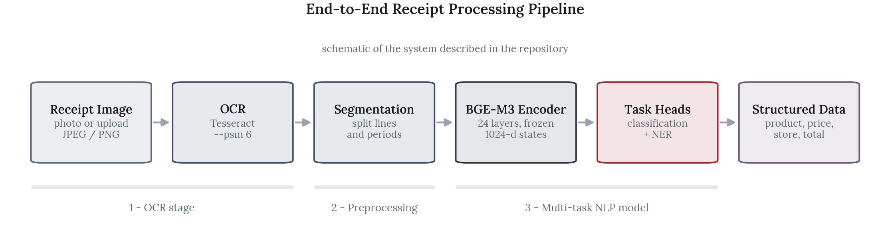{fig-alt="Complete receipt processing pipeline from image to structured data" width="100%"}

This end-to-end approach enables users to simply photograph a receipt and automatically extract structured information like product names, prices, store information, and totals.

# OCR Integration

## Receipt Image Processing

The system begins with receipt images captured via camera or uploaded as files. OCR technology extracts text from these images, handling challenges like:

- **Varied receipt formats**: Different store layouts, fonts, and structures
- **Image quality**: Blurry photos, poor lighting, or low resolution
- **Text orientation**: Rotated or skewed text
- **Mixed content**: Barcodes, logos, and text

## OCR Implementation

The project uses Tesseract OCR (via `pytesseract`) for text extraction, with preprocessing steps to improve accuracy:

- **Image preprocessing**: Grayscale conversion, noise reduction, contrast enhancement
- **Text detection**: Automatic text region detection and orientation correction
- **Line segmentation**: Splitting OCR output into individual lines and sentences

```python
import pytesseract
from PIL import Image
import cv2

def preprocess_receipt_image(image_path):
    """Preprocess receipt image for better OCR accuracy"""
    img = cv2.imread(image_path)
    gray = cv2.cvtColor(img, cv2.COLOR_BGR2GRAY)
    # Apply denoising and thresholding
    denoised = cv2.fastNlMeansDenoising(gray)
    _, thresh = cv2.threshold(denoised, 0, 255, cv2.THRESH_BINARY + cv2.THRESH_OTSU)
    return thresh

def extract_text_from_receipt(image_path):
    """Extract text from receipt image using OCR"""
    processed_img = preprocess_receipt_image(image_path)
    text = pytesseract.image_to_string(processed_img, config='--psm 6')
    return text
```

## Text Segmentation

After OCR extraction, the raw text is segmented into sentences using:

- **Rule-based segmentation**: Period, newline, and punctuation-based splitting
- **Sentence boundary detection**: Handling abbreviations and decimal numbers
- **Line grouping**: Combining related lines that belong to the same logical sentence

The segmented sentences are then tokenized and prepared for the transformer model.

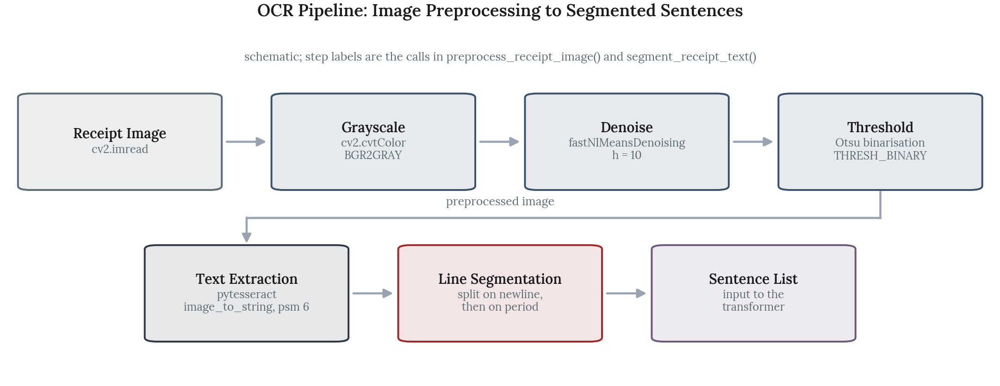{fig-alt="OCR pipeline showing image preprocessing, text extraction, and segmentation" width="100%"}

# Sentence Transformer Foundation

## Model Choice: BGE-M3

The project uses the BGE-M3 (BAAI General Embedding) model by the Beijing Academy of Artificial Intelligence, selected for its strong general-purpose sentence representations. It is an XLM-RoBERTa-large backbone: 24 layers, 1024 hidden dimensions, a 250,000 token vocabulary and a 2.3 GB checkpoint. That is a substantial model rather than a lightweight one, which is a real constraint on deployment.

What it offers this project:

- **Generalized embeddings**: High-quality sentence representations that capture semantic meaning
- **Rich token-level representations**: Essential for token-level tasks like NER
- **Multilingual coverage**: Useful for receipts that mix languages or currencies

One clarification worth making, since the name invites it: the "M3" in BGE-M3 stands for multi-lingual, multi-granularity and multi-functionality, where multi-functionality means dense, sparse and ColBERT-style retrieval. It does not mean the model is pre-built for multi-task classification and NER. The multi-task structure here is added on top.

The model generates 1024-dimensional embeddings that encode semantic information in a dense vector space, enabling downstream tasks to leverage these rich representations.

## Sentence Embeddings

Each sentence is encoded into a fixed-length vector where semantically similar sentences are positioned close together in the embedding space. The BGE-M3 model processes input text and produces normalized embeddings that capture:

- Semantic meaning and context
- Syntactic structure
- Domain-specific patterns

For a batch of 15 example sentences, the model produces embeddings of shape `[15, 1024]`, where each row represents one sentence's encoding in the 1024-dimensional space.

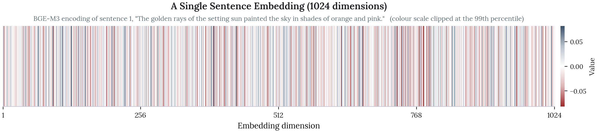{fig-alt="Heatmap visualization of a single sentence embedding showing 1024-dimensional vector" width="100%"}

## Sentence Similarity

The embedding space enables similarity computation between sentences. Cosine similarity measures the angle between embedding vectors, with values close to 1 indicating high semantic similarity and values near 0 indicating dissimilarity.

This property is crucial for:
- **Semantic search**: Finding documents or sentences similar to a query
- **Clustering**: Grouping related sentences together
- **Classification**: Using similarity as a feature for downstream tasks

## Clustering and Visualization

Using K-Means clustering on the embeddings reveals natural groupings of semantically similar sentences. When visualized with t-SNE dimensionality reduction, sentences cluster together based on shared themes, topics, or structures.

The figures below are computed on a set of 15 general-purpose sentences covering unrelated topics, which is what the notebook encodes. They demonstrate that the embedding space separates distinct subject matter cleanly, but they are not evidence about receipt text specifically. Confirming that product, price and store lines separate would require running the same analysis on a labelled receipt corpus.

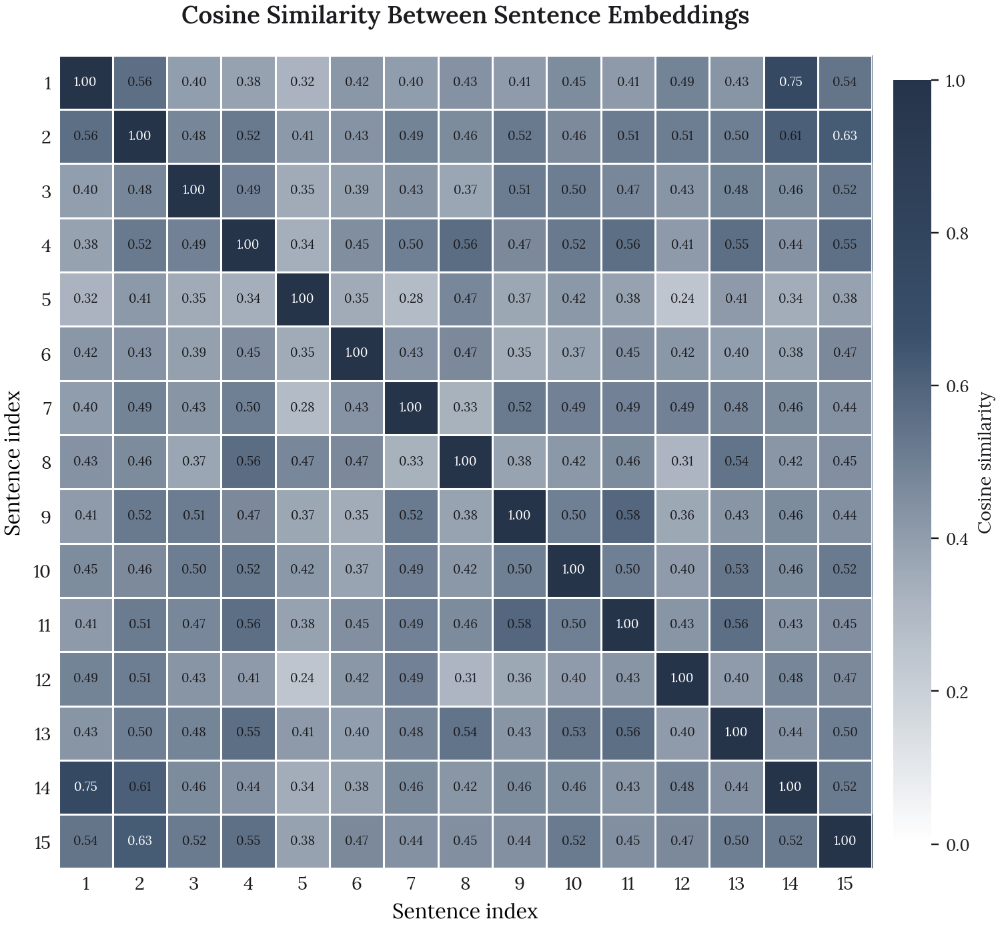{fig-alt="Cosine similarity matrix heatmap showing semantic relationships between sentences" width="100%"}

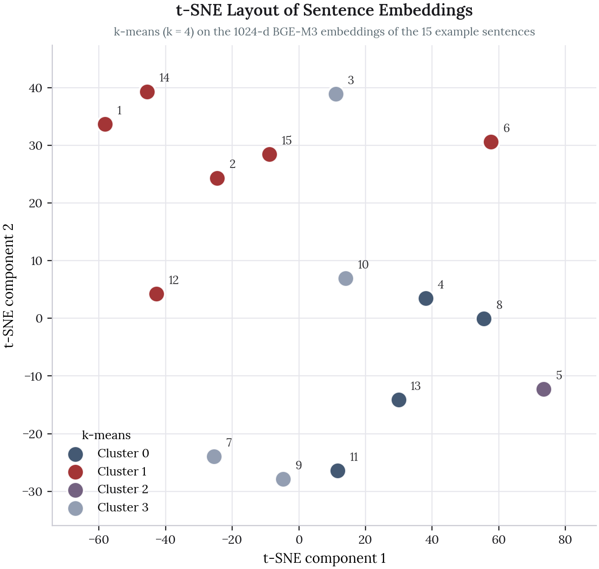{fig-alt="t-SNE 2D visualization of sentence embeddings colored by K-means clusters" width="100%"}

# Multi-Task Learning Architecture

The multi-task architecture enables the model to perform both sentence classification and named entity recognition simultaneously, sharing the transformer backbone for efficient learning.

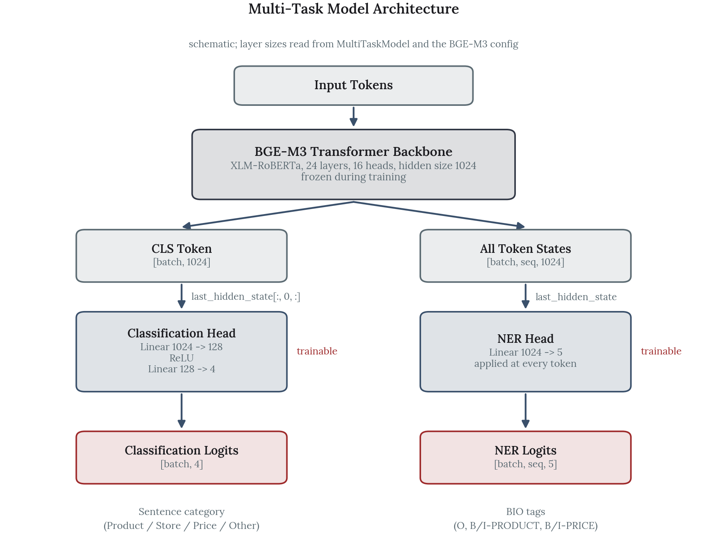{fig-alt="Multi-task model architecture diagram showing transformer backbone with classification and NER heads" width="100%"}

## Shared Transformer Backbone

The architecture builds on the pre-trained BGE-M3 transformer, which serves as a shared backbone for both tasks. The transformer processes input text and produces:

- **CLS token embedding**: A global sentence representation from the special classification token
- **Token-level embeddings**: Per-token representations for the entire sequence

These outputs are routed to two separate task-specific heads that learn specialized patterns for their respective tasks.

## Sentence Classification Head

The classification head categorizes entire sentences into predefined classes (Product Name, Store Name, Price, Other). The architecture consists of:

1. **First Linear Layer**: Maps the 1024-dimensional CLS embedding to 128 dimensions, reducing dimensionality for efficiency
2. **ReLU Activation**: Introduces non-linearity to learn complex patterns while promoting sparse activations
3. **Second Linear Layer**: Maps to the final number of classes (4 categories)

The head uses only the CLS token representation, which is trained to capture global sentence meaning during pre-training.

```python
self.classifier = nn.Sequential(
    nn.Linear(base_model.config.hidden_size, 128),
    nn.ReLU(),
    nn.Linear(128, num_classes)
)
```

## Named Entity Recognition Head

The NER head performs token-level classification to identify entities within sentences. Unlike sentence classification, NER requires predictions for each token in the sequence.

The architecture is simpler, being a single linear layer that maps each token's hidden state to NER label logits:

```python
self.ner_head = nn.Linear(base_model.config.hidden_size, num_ner_labels)
```

The model predicts one of five labels per token:
- **O**: Outside entity (not part of any entity)
- **B-PRODUCT**: Beginning of a product name
- **I-PRODUCT**: Inside of a product name
- **B-PRICE**: Beginning of a price entity
- **I-PRICE**: Inside of a price entity

This BIO tagging scheme allows the model to identify multi-token entities like "500g Organic Canned Tomatoes" or "$32.66".

## Architecture Visualization

The diagram below illustrates how input text flows through the transformer backbone and is routed to both task-specific heads:

- **Input**: Tokenized receipt sentences
- **Transformer**: BGE-M3 processes tokens and produces hidden states
- **CLS Token**: Extracted for sentence-level classification
- **All Tokens**: Used for token-level NER predictions
- **Outputs**: Classification logits and NER label logits

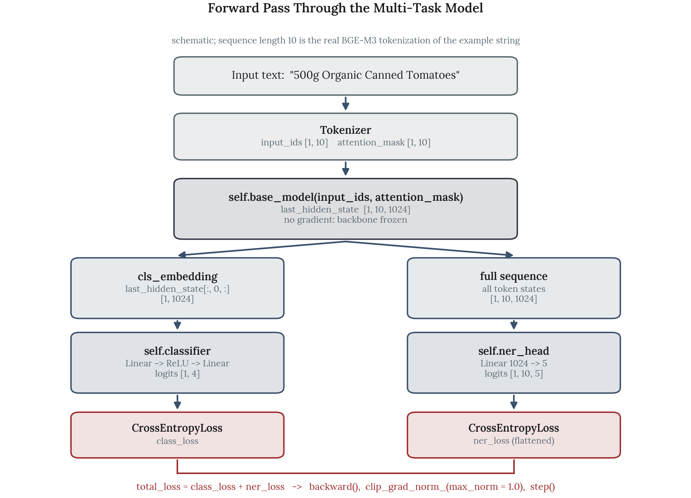{fig-alt="Detailed forward pass flow showing data transformation through each layer" width="100%"}

# Training Considerations

## Freezing Strategy

The write-up below sets out the freezing strategy the architecture was designed around. It is worth stating plainly that the current code does not implement it: `MultiTaskModel.__init__` never sets `requires_grad = False`, and the optimizer receives `model.parameters()`, so gradients would flow through the whole backbone. Freezing is the intended design, not the present behaviour.

### Freezing the Transformer Backbone

**Advantages:**
- Only task-specific heads are updated, significantly reducing computational cost
- Training is faster since the large transformer parameters remain fixed
- Leverages high-quality pre-trained embeddings without modification

**Trade-offs:**
- Limited adaptation if the target domain differs significantly from pre-training data
- May not capture domain-specific nuances in the transformer layers

For receipt processing, freezing the backbone is effective because:
- BGE-M3 embeddings are general enough to capture receipt text patterns
- The task-specific heads can adapt to receipt-specific categories
- Computational efficiency is important for practical deployment

### Alternative Freezing Strategies

**Freezing the entire network**: Fastest but least flexible, and useful only for inference.

**Freezing one task head**: Useful when one task is well-learned but the other needs adaptation, though this risks imbalanced learning.

## Transfer Learning

### Pre-Trained Model Selection

BGE-M3 was chosen because it:
- Supports multi-task learning natively
- Provides both sentence-level and token-level representations
- Is efficient and scalable for production use
- Was trained on diverse text, making it suitable for receipt processing

### Layer Freezing Rationale

The intended design freezes the transformer backbone while task-specific heads remain trainable. This approach:
- Prevents catastrophic forgetting of general language knowledge
- Allows heads to adapt to receipt-specific patterns
- Reduces training time and memory requirements
- Maintains strong baseline performance from pre-trained embeddings

Implementing it is a two-line change, and is the first thing to do before any training run.

# Training Loop Implementation

## Dataset Structure

Training data comes from **CORD-v2**, the Consolidated Receipt Dataset, which provides 1,000 photographed receipts with line-level annotations. CORD groups the lines of a receipt into rows using a `group_id`, so a single row becomes one training sentence:

```
menu.cnt    "1"
menu.nm     "REAL GANACHE"    ->   "1 REAL GANACHE 16,500"
menu.price  "16,500"
```

This grouping is what makes the problem genuinely multi-task rather than two views of the same label. The sentence class describes what kind of line it is, while the entity tags mark which tokens inside it are the product name and which are the price.

The two label sets map onto the heads the model already declares, so no architectural change was needed:

| | Labels |
|---|---|
| **Sentence class** (4) | ITEM, ITEM_OPTION, SUBTOTAL, TOTAL |
| **Entity tags** (5) | O, B-NAME, I-NAME, B-PRICE, I-PRICE |

| Split | Sentences | ITEM | ITEM_OPTION | SUBTOTAL | TOTAL |
|---|--:|--:|--:|--:|--:|
| Train | 3,430 | 1,921 | 183 | 531 | 795 |
| Validation | 386 | 202 | 19 | 65 | 100 |
| Test | 414 | 229 | 22 | 63 | 100 |

Word-level tags are aligned to BGE-M3 subword tokens using the tokenizer's `word_ids()` mapping. Only the first subword of each word carries the label; continuation subwords and padding are masked to `-100` so they contribute nothing to the loss.

A worked example of one training sentence:

```
[ITEM]  1/O  x/O  Nasi/B-NAME  Campur/I-NAME  Bali/I-NAME  75,000/B-PRICE
```

## Forward Pass Design

### GPU Acceleration

The model and tensors are moved to CUDA when available, enabling parallel computation on GPUs for faster training.

### Mini-Batch Processing

Training uses mini-batches to:
- Optimize memory usage
- Stabilize gradient updates
- Enable parallel processing on GPUs

### Task-Specific Outputs

- **Classification**: Uses only the CLS token embedding for sentence-level prediction
- **NER**: Uses all token embeddings for sequence-level prediction

### Joint Optimization

Both tasks are optimized together:
- Losses are computed independently for each head
- Total loss is the sum of classification and NER losses
- Gradients flow through the shared transformer backbone
- This allows shared knowledge to improve both tasks simultaneously

### Gradient Clipping

Gradient clipping prevents exploding gradients that could destabilize multi-task learning, especially important when optimizing multiple objectives simultaneously.

## Evaluation Metrics

The training loop tracks:
- **Classification accuracy**: Percentage of correctly classified sentences
- **Classification F1 score**: Weighted F1 to handle class imbalance
- **NER accuracy**: Token-level classification accuracy
- **Separate loss tracking**: Monitors each task's loss independently to detect task imbalance

Both training and validation metrics are computed to ensure the model generalizes well to unseen receipt text.

## Training Results

The backbone is frozen, so its token states are computed once and cached and only the heads are trained. That is 137K trainable parameters against 568M frozen, or 0.024 percent of the model, which is what makes the run finish in under a minute on a laptop GPU.

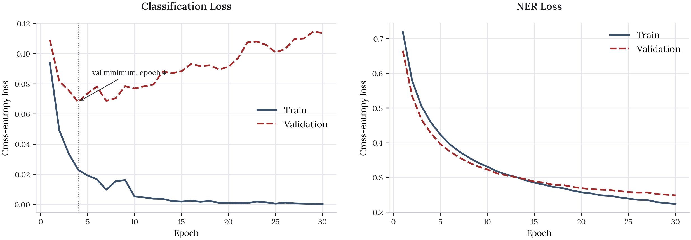{fig-alt="Classification and NER loss curves over 30 epochs, showing classification overfitting after epoch 4 while NER keeps improving" width="100%"}

The two tasks want different amounts of training, and this is the most interesting thing in the run. Classification validation loss reaches its minimum at **epoch 4** and then climbs steadily while training loss goes to zero, which is straightforward overfitting on a task the model has essentially already solved. NER validation loss is still falling at epoch 30.

Training both heads to a single stopping point therefore means choosing which task to compromise. Stopping early protects classification and leaves entity tagging undertrained; running to 30 epochs does the reverse. Separate learning rates, or a loss weighting that decays the classification term, would be the way to serve both.

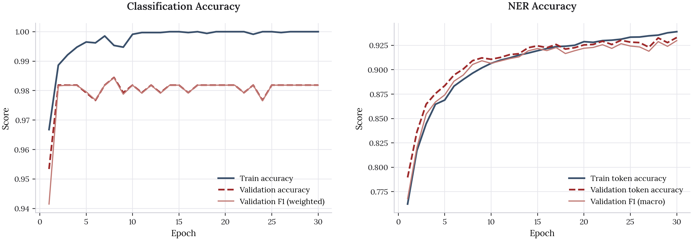{fig-alt="Classification and NER accuracy and F1 curves across training" width="100%"}

Classification accuracy saturates near 98 percent within a handful of epochs. NER climbs more slowly and is still improving at the end of training.

### Held-Out Test Results

| Task | Metric | Score |
|---|---|--:|
| Classification | Accuracy | **0.978** |
| Classification | F1 (weighted) | 0.979 |
| Entity tagging | Token accuracy | 0.902 |
| Entity tagging | **F1 (macro)** | **0.898** |

Token accuracy is reported alongside macro-F1 deliberately. Roughly a quarter of tokens carry the `O` tag, so token accuracy is flattered by the majority class; macro-F1 weights all five tags equally and is the number worth quoting.

# Example Predictions

All predictions below come from the trained heads running on held-out test sentences. A dashed outline marks a token where the model disagrees with the reference tag.

## Product Line

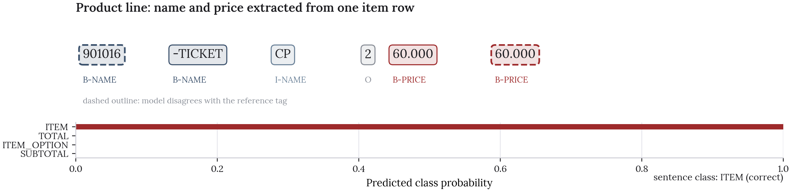{fig-alt="A product line with per-token entity tags and predicted class probabilities" width="100%"}

## Price Extraction

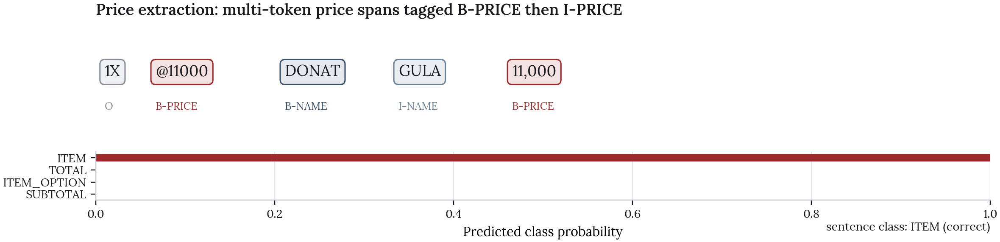{fig-alt="A receipt line where a multi-token price span is tagged B-PRICE then I-PRICE" width="100%"}

## Total Line

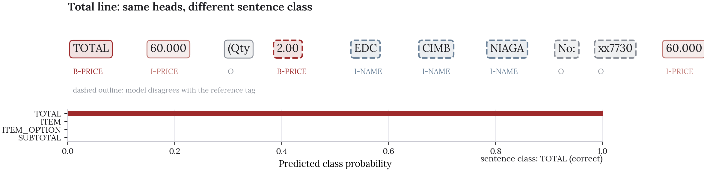{fig-alt="A total line classified by the same heads, showing a different sentence class" width="100%"}

The same two heads handle all three, which is the point of the shared backbone: one encoder pass produces both the sentence label and the token tags.

## Complete Receipt

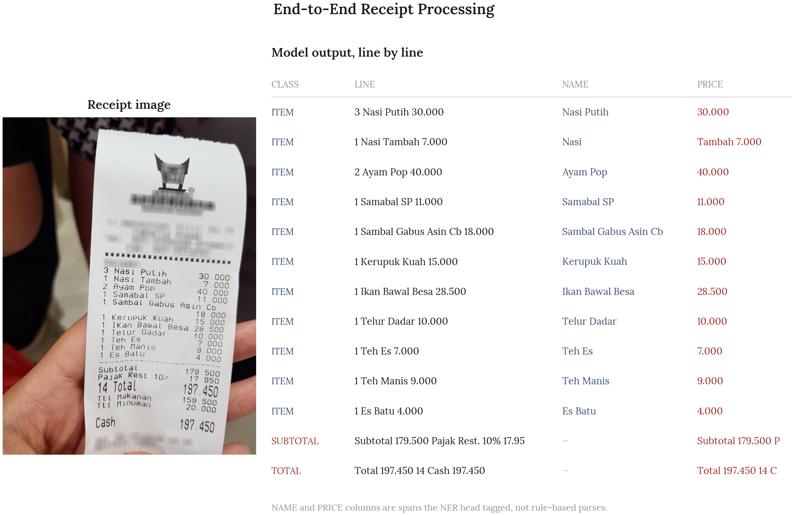{fig-alt="A receipt photograph beside the model's line-by-line classification and extracted name and price spans" width="100%"}

Running every line of one receipt through the model gives a structured parse of the whole thing. Eleven of the twelve rows are handled correctly.

The twelfth is worth pointing at rather than hiding. The line `1 Nasi Tambah 7.000` is split as name `Nasi` and price `Tambah 7.000`, so the model has taken an Indonesian word it does not recognise as part of a product name and pushed it into the price span. Every other name on the receipt is a dish it has seen patterns for. This is the expected failure mode for a frozen multilingual encoder on a vocabulary it was never fine-tuned on, and it is the clearest argument for unfreezing the top layers.

# Implementation Highlights

## Multi-Task Model Class

The `MultiTaskModel` class inherits from PyTorch's `nn.Module` and implements:

- **Initialization**: Sets up the transformer backbone and both task heads
- **Forward pass**: Routes transformer outputs to classification and NER heads
- **Flexible architecture**: Configurable number of classes and NER labels

## Training Function

The training loop implements:
- **Epoch-based iteration**: Multiple passes through the dataset
- **Train/validation split**: Separate evaluation on held-out data
- **Loss computation**: Combined loss for joint optimization
- **Metric tracking**: Real-time accuracy and F1 score monitoring
- **Model checkpointing**: Ready for saving best models

# Next Steps

**Domain Adaptation**: Fine-tune the transformer backbone on receipt-specific data if initial results show domain mismatch.

**Architecture Improvements**: Experiment with attention mechanisms or more complex head architectures to improve performance on challenging cases.

**Evaluation**: Add comprehensive evaluation on a held-out test set with detailed per-class metrics and confusion matrices.

**Production Deployment**: Optimize the model for inference, including quantization and model compression for faster prediction.

**Extended Entity Types**: Expand NER to recognize additional entities like dates, locations, and payment methods.

# Limitations

**The data is not the data the system was designed for.** CORD receipts are Indonesian, and the label scheme is CORD's hierarchy mapped onto this model's four classes and five tags. A deployment on English grocery receipts would need its own labelled sample.

**The backbone is frozen, so the encoder never adapts.** The `Nasi Tambah` error above is a direct consequence. Unfreezing the top few layers is the obvious next experiment, at the cost of needing real GPU time rather than a cached forward pass.

**Entity scoring is token-level, not span-level.** A prediction that gets `B-NAME` right and one `I-NAME` wrong still scores well on macro-F1, where a strict span match would count the entity as missed. Span-level scoring would give a lower and more honest number.

**One stopping point serves two tasks badly.** Classification is overfitting from epoch 4 while NER is still improving at 30, and the current run simply picks 30.

**OCR is not in the measured loop.** The end-to-end figure uses CORD's transcribed lines, not Tesseract output on the photograph. Real OCR error would degrade both tasks, and that degradation is unmeasured.

# Next Steps

**Unfreeze the top encoder layers**: The most likely source of improvement on entity tagging, and a direct test of the frozen-backbone assumption.

**Weight the two losses**: Decay the classification term once it saturates so the shared representation keeps serving NER.

**Score entities at span level**: Replace token macro-F1 with strict and relaxed span matching.

**Close the OCR loop**: Run Tesseract over the receipt photographs and re-measure both tasks on its output, to find how much accuracy the OCR stage actually costs.
